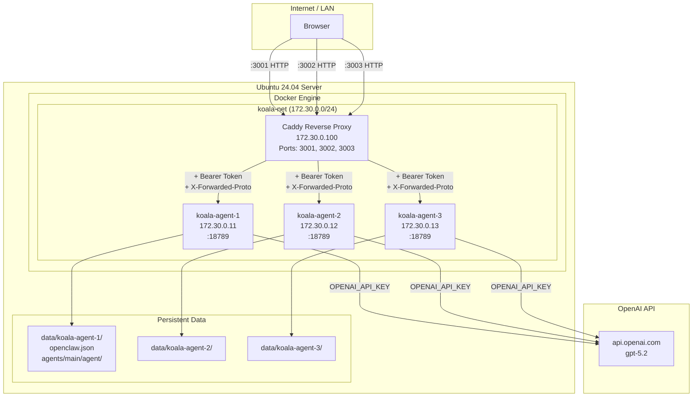
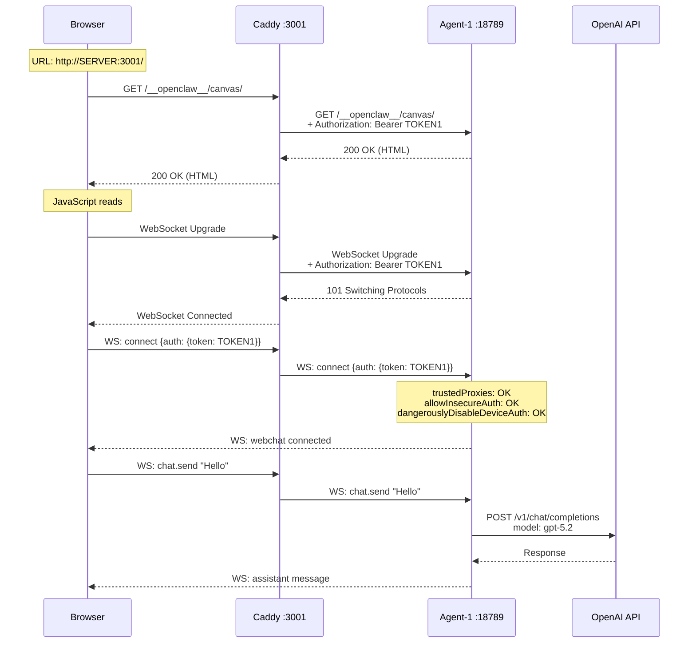
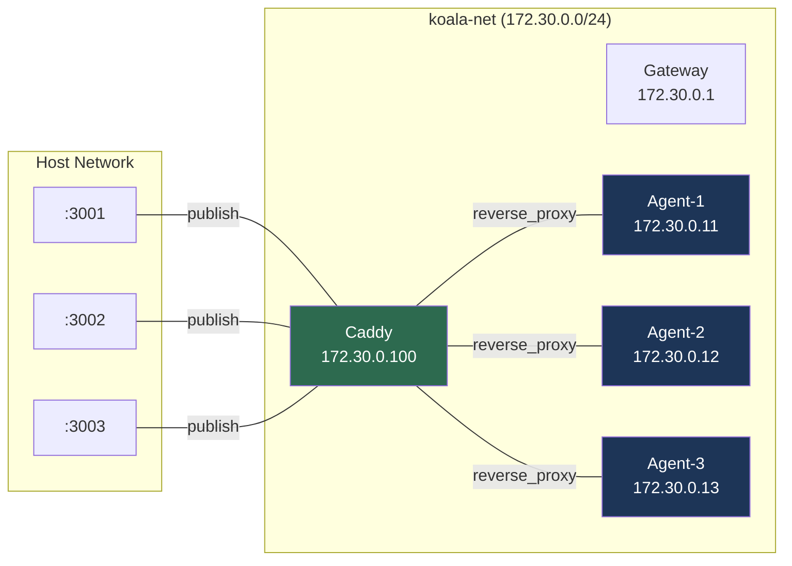
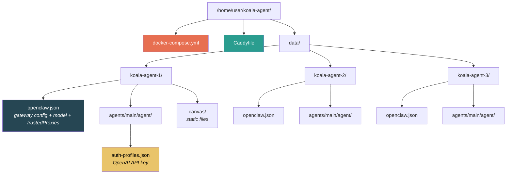
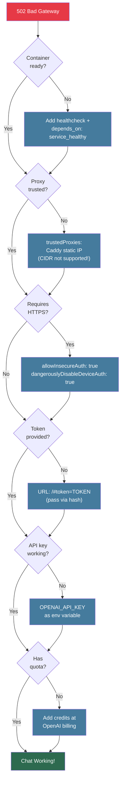

# OpenClaw Multi-Agent Setup Guide

> Deploy 3 isolated OpenClaw agents behind a Caddy reverse proxy on a fresh Ubuntu 24.04 server.

## Architecture

### System Overview



### Request Flow



### Docker Network Layout



### File Structure



### Troubleshooting Decision Tree



---

- **Caddy**: Reverse proxy + Bearer token auth injection
- **OpenClaw Agents**: Each runs independently with its own state directory
- **Docker Network**: Static-IP bridge network (required for trustedProxies)

---

## Prerequisites

- Ubuntu 24.04 LTS
- Docker & Docker Compose v2
- OpenAI API key (with billing credits)
- Root or sudo access

---

## 1. Install Docker (if not installed)

```bash
sudo apt update && sudo apt install -y ca-certificates curl gnupg
sudo install -m 0755 -d /etc/apt/keyrings
curl -fsSL https://download.docker.com/linux/ubuntu/gpg | sudo gpg --dearmor -o /etc/apt/keyrings/docker.gpg
sudo chmod a+r /etc/apt/keyrings/docker.gpg
echo "deb [arch=$(dpkg --print-architecture) signed-by=/etc/apt/keyrings/docker.gpg] https://download.docker.com/linux/ubuntu $(. /etc/os-release && echo "$VERSION_CODENAME") stable" | sudo tee /etc/apt/sources.list.d/docker.list > /dev/null
sudo apt update && sudo apt install -y docker-ce docker-ce-cli containerd.io docker-compose-plugin
sudo usermod -aG docker $USER
```

---

## 2. Create Directory Structure

```bash
sudo mkdir -p /home/$USER/koala-agent/data/koala-agent-{1,2,3}
cd /home/$USER/koala-agent
```

---

## 3. Generate Tokens

Generate a unique gateway token for each agent:

```bash
TOKEN1=$(openssl rand -hex 32)
TOKEN2=$(openssl rand -hex 32)
TOKEN3=$(openssl rand -hex 32)
echo "Agent 1 Token: $TOKEN1"
echo "Agent 2 Token: $TOKEN2"
echo "Agent 3 Token: $TOKEN3"
```

> Save these tokens. They are used in all configuration files below.

---

## 4. docker-compose.yml

Replace `<OPENAI_API_KEY>` and `<TOKEN>` placeholders with your own values:

```yaml
services:
  koala-agent-1:
    image: alpine/openclaw:latest
    container_name: koala-agent-1
    restart: unless-stopped
    environment:
      - OPENCLAW_GATEWAY_TOKEN=<TOKEN1>
      - OPENCLAW_STATE_DIR=/state
      - OPENAI_API_KEY=<OPENAI_API_KEY>
    volumes:
      - ./data/koala-agent-1:/state
    networks:
      koala-net:
        ipv4_address: 172.30.0.11
    healthcheck:
      test: ["CMD", "wget", "--spider", "-q", "--header=Authorization: Bearer <TOKEN1>", "http://127.0.0.1:18789/__openclaw__/canvas/"]
      interval: 15s
      timeout: 5s
      retries: 5
      start_period: 20s

  koala-agent-2:
    image: alpine/openclaw:latest
    container_name: koala-agent-2
    restart: unless-stopped
    environment:
      - OPENCLAW_GATEWAY_TOKEN=<TOKEN2>
      - OPENCLAW_STATE_DIR=/state
      - OPENAI_API_KEY=<OPENAI_API_KEY>
    volumes:
      - ./data/koala-agent-2:/state
    networks:
      koala-net:
        ipv4_address: 172.30.0.12
    healthcheck:
      test: ["CMD", "wget", "--spider", "-q", "--header=Authorization: Bearer <TOKEN2>", "http://127.0.0.1:18789/__openclaw__/canvas/"]
      interval: 15s
      timeout: 5s
      retries: 5
      start_period: 20s

  koala-agent-3:
    image: alpine/openclaw:latest
    container_name: koala-agent-3
    restart: unless-stopped
    environment:
      - OPENCLAW_GATEWAY_TOKEN=<TOKEN3>
      - OPENCLAW_STATE_DIR=/state
      - OPENAI_API_KEY=<OPENAI_API_KEY>
    volumes:
      - ./data/koala-agent-3:/state
    networks:
      koala-net:
        ipv4_address: 172.30.0.13
    healthcheck:
      test: ["CMD", "wget", "--spider", "-q", "--header=Authorization: Bearer <TOKEN3>", "http://127.0.0.1:18789/__openclaw__/canvas/"]
      interval: 15s
      timeout: 5s
      retries: 5
      start_period: 20s

  caddy:
    image: caddy:2-alpine
    container_name: koala-caddy
    restart: unless-stopped
    depends_on:
      koala-agent-1:
        condition: service_healthy
      koala-agent-2:
        condition: service_healthy
      koala-agent-3:
        condition: service_healthy
    ports:
      - "3001:3001"
      - "3002:3002"
      - "3003:3003"
    volumes:
      - ./Caddyfile:/etc/caddy/Caddyfile:ro
      - caddy_data:/data
      - caddy_config:/config
    networks:
      koala-net:
        ipv4_address: 172.30.0.100

networks:
  koala-net:
    driver: bridge
    ipam:
      config:
        - subnet: 172.30.0.0/24
          gateway: 172.30.0.1

volumes:
  caddy_data:
  caddy_config:
```

---

## 5. Caddyfile

```caddyfile
:3001 {
	reverse_proxy koala-agent-1:18789 {
		header_up Authorization "Bearer <TOKEN1>"
		header_up X-Forwarded-Proto "https"
	}
	log {
		output stderr
		level WARN
	}
}

:3002 {
	reverse_proxy koala-agent-2:18789 {
		header_up Authorization "Bearer <TOKEN2>"
		header_up X-Forwarded-Proto "https"
	}
	log {
		output stderr
		level WARN
	}
}

:3003 {
	reverse_proxy koala-agent-3:18789 {
		header_up Authorization "Bearer <TOKEN3>"
		header_up X-Forwarded-Proto "https"
	}
	log {
		output stderr
		level WARN
	}
}
```

---

## 6. OpenClaw Config (openclaw.json)

Create a separate `openclaw.json` for each agent. Replace `<SERVER_IP>`, `<PORT>`, and `<TOKEN>`:

**data/koala-agent-1/openclaw.json:**
```json
{
    "agents": {
        "defaults": {
            "model": {
                "primary": "openai/gpt-5.2"
            }
        }
    },
    "gateway": {
        "port": 18789,
        "bind": "lan",
        "controlUi": {
            "allowedOrigins": ["http://<SERVER_IP>:3001"],
            "allowInsecureAuth": true,
            "dangerouslyDisableDeviceAuth": true
        },
        "auth": {
            "token": "<TOKEN1>"
        },
        "trustedProxies": ["172.30.0.100"]
    }
}
```

**data/koala-agent-2/openclaw.json:** (same structure, use TOKEN2 and port 3002)

**data/koala-agent-3/openclaw.json:** (same structure, use TOKEN3 and port 3003)

> **Critical settings explained:**
> - `trustedProxies: ["172.30.0.100"]` — Caddy's static IP. **CIDR ranges are NOT supported**; use the exact IP address.
> - `allowInsecureAuth: true` — Allows Control UI access over plain HTTP.
> - `dangerouslyDisableDeviceAuth: true` — Disables browser device identity checks over HTTP.
> - `allowedOrigins` — Must match the browser origin exactly (including port).

---

## 7. Auth Profiles (API Key)

Create the auth-profiles file for each agent:

```bash
for i in 1 2 3; do
  mkdir -p data/koala-agent-$i/agents/main/agent
  cat > data/koala-agent-$i/agents/main/agent/auth-profiles.json << 'EOF'
{
  "version": 1,
  "profiles": {
    "openai": {
      "type": "api_key",
      "provider": "openai",
      "key": "<OPENAI_API_KEY>"
    }
  }
}
EOF
done
```

---

## 8. File Permissions

The OpenClaw container runs as `uid=1000 (node)`:

```bash
sudo chown -R 1000:1000 data/
chmod -R u+rwX,g+rwX,o-rwx data/
```

---

## 9. Start the Stack

```bash
cd /home/$USER/koala-agent
docker compose pull
docker compose up -d
```

Wait approximately 30 seconds for healthchecks to pass:

```bash
docker compose ps
```

All containers should show `(healthy)`.

---

## 10. Verify

```bash
# HTTP endpoint test
for port in 3001 3002 3003; do
  CODE=$(curl -s -o /dev/null -w "%{http_code}" http://localhost:$port/__openclaw__/canvas/)
  echo "Port $port -> HTTP $CODE"
done
```

Expected output: `HTTP 200` for each port.

---

## 11. Browser Access

Access the Control UI by passing the token in the URL hash:

```
http://<SERVER_IP>:3001/#token=<TOKEN1>
http://<SERVER_IP>:3002/#token=<TOKEN2>
http://<SERVER_IP>:3003/#token=<TOKEN3>
```

> The token is passed via `#` (hash fragment) so it is never sent to the server — only the browser JavaScript reads it.

---

## Automated Setup Script

Save the following as `setup.sh` and run it for a one-command deployment:

```bash
#!/bin/bash
set -euo pipefail

# ═══════════════════════════════════════
# CONFIGURATION - EDIT THESE VALUES
# ═══════════════════════════════════════
OPENAI_API_KEY="sk-proj-YOUR_KEY_HERE"
SERVER_IP="$(hostname -I | awk '{print $1}')"
INSTALL_DIR="/home/$USER/koala-agent"
MODEL="openai/gpt-5.2"

# Generate unique tokens
TOKEN1=$(openssl rand -hex 32)
TOKEN2=$(openssl rand -hex 32)
TOKEN3=$(openssl rand -hex 32)

echo "══════════════════════════════════════"
echo "  OpenClaw Multi-Agent Setup"
echo "  Server: $SERVER_IP"
echo "══════════════════════════════════════"

# Create directories
mkdir -p $INSTALL_DIR/data/koala-agent-{1,2,3}/agents/main/agent

# docker-compose.yml
cat > $INSTALL_DIR/docker-compose.yml << COMPOSEOF
services:
  koala-agent-1:
    image: alpine/openclaw:latest
    container_name: koala-agent-1
    restart: unless-stopped
    environment:
      - OPENCLAW_GATEWAY_TOKEN=$TOKEN1
      - OPENCLAW_STATE_DIR=/state
      - OPENAI_API_KEY=$OPENAI_API_KEY
    volumes:
      - ./data/koala-agent-1:/state
    networks:
      koala-net:
        ipv4_address: 172.30.0.11
    healthcheck:
      test: ["CMD", "wget", "--spider", "-q", "--header=Authorization: Bearer $TOKEN1", "http://127.0.0.1:18789/__openclaw__/canvas/"]
      interval: 15s
      timeout: 5s
      retries: 5
      start_period: 20s

  koala-agent-2:
    image: alpine/openclaw:latest
    container_name: koala-agent-2
    restart: unless-stopped
    environment:
      - OPENCLAW_GATEWAY_TOKEN=$TOKEN2
      - OPENCLAW_STATE_DIR=/state
      - OPENAI_API_KEY=$OPENAI_API_KEY
    volumes:
      - ./data/koala-agent-2:/state
    networks:
      koala-net:
        ipv4_address: 172.30.0.12
    healthcheck:
      test: ["CMD", "wget", "--spider", "-q", "--header=Authorization: Bearer $TOKEN2", "http://127.0.0.1:18789/__openclaw__/canvas/"]
      interval: 15s
      timeout: 5s
      retries: 5
      start_period: 20s

  koala-agent-3:
    image: alpine/openclaw:latest
    container_name: koala-agent-3
    restart: unless-stopped
    environment:
      - OPENCLAW_GATEWAY_TOKEN=$TOKEN3
      - OPENCLAW_STATE_DIR=/state
      - OPENAI_API_KEY=$OPENAI_API_KEY
    volumes:
      - ./data/koala-agent-3:/state
    networks:
      koala-net:
        ipv4_address: 172.30.0.13
    healthcheck:
      test: ["CMD", "wget", "--spider", "-q", "--header=Authorization: Bearer $TOKEN3", "http://127.0.0.1:18789/__openclaw__/canvas/"]
      interval: 15s
      timeout: 5s
      retries: 5
      start_period: 20s

  caddy:
    image: caddy:2-alpine
    container_name: koala-caddy
    restart: unless-stopped
    depends_on:
      koala-agent-1:
        condition: service_healthy
      koala-agent-2:
        condition: service_healthy
      koala-agent-3:
        condition: service_healthy
    ports:
      - "3001:3001"
      - "3002:3002"
      - "3003:3003"
    volumes:
      - ./Caddyfile:/etc/caddy/Caddyfile:ro
      - caddy_data:/data
      - caddy_config:/config
    networks:
      koala-net:
        ipv4_address: 172.30.0.100

networks:
  koala-net:
    driver: bridge
    ipam:
      config:
        - subnet: 172.30.0.0/24
          gateway: 172.30.0.1

volumes:
  caddy_data:
  caddy_config:
COMPOSEOF

# Caddyfile
cat > $INSTALL_DIR/Caddyfile << CADDYEOF
:3001 {
	reverse_proxy koala-agent-1:18789 {
		header_up Authorization "Bearer $TOKEN1"
		header_up X-Forwarded-Proto "https"
	}
	log {
		output stderr
		level WARN
	}
}

:3002 {
	reverse_proxy koala-agent-2:18789 {
		header_up Authorization "Bearer $TOKEN2"
		header_up X-Forwarded-Proto "https"
	}
	log {
		output stderr
		level WARN
	}
}

:3003 {
	reverse_proxy koala-agent-3:18789 {
		header_up Authorization "Bearer $TOKEN3"
		header_up X-Forwarded-Proto "https"
	}
	log {
		output stderr
		level WARN
	}
}
CADDYEOF

# openclaw.json per agent
TOKENS=($TOKEN1 $TOKEN2 $TOKEN3)
PORTS=(3001 3002 3003)
for i in 1 2 3; do
  idx=$((i-1))
  cat > $INSTALL_DIR/data/koala-agent-$i/openclaw.json << CFGEOF
{
    "agents": {
        "defaults": {
            "model": {
                "primary": "$MODEL"
            }
        }
    },
    "gateway": {
        "port": 18789,
        "bind": "lan",
        "controlUi": {
            "allowedOrigins": ["http://$SERVER_IP:${PORTS[$idx]}"],
            "allowInsecureAuth": true,
            "dangerouslyDisableDeviceAuth": true
        },
        "auth": {
            "token": "${TOKENS[$idx]}"
        },
        "trustedProxies": ["172.30.0.100"]
    }
}
CFGEOF

  # Auth profiles
  cat > $INSTALL_DIR/data/koala-agent-$i/agents/main/agent/auth-profiles.json << AUTHEOF
{
  "version": 1,
  "profiles": {
    "openai": {
      "type": "api_key",
      "provider": "openai",
      "key": "$OPENAI_API_KEY"
    }
  }
}
AUTHEOF
done

# Fix permissions (container runs as uid 1000)
sudo chown -R 1000:1000 $INSTALL_DIR/data/
chmod -R u+rwX,g+rwX,o-rwx $INSTALL_DIR/data/

# Deploy
cd $INSTALL_DIR
docker compose pull
docker compose up -d

echo ""
echo "Starting containers, waiting 30 seconds for healthchecks..."
sleep 30

# Verify
echo ""
echo "══════════════════════════════════════"
echo "  Test Results"
echo "══════════════════════════════════════"
docker compose ps
echo ""
for port in 3001 3002 3003; do
  CODE=$(curl -s -o /dev/null -w "%{http_code}" http://127.0.0.1:$port/__openclaw__/canvas/)
  echo "  Port $port -> HTTP $CODE"
done

echo ""
echo "══════════════════════════════════════"
echo "  Setup Complete!"
echo "══════════════════════════════════════"
echo ""
echo "  Access URLs:"
echo "    Agent 1: http://$SERVER_IP:3001/#token=$TOKEN1"
echo "    Agent 2: http://$SERVER_IP:3002/#token=$TOKEN2"
echo "    Agent 3: http://$SERVER_IP:3003/#token=$TOKEN3"
echo ""
echo "  Save your tokens!"
echo "  Model: $MODEL"
echo ""
```

Usage:
```bash
chmod +x setup.sh
# Edit OPENAI_API_KEY in the script, then:
sudo bash setup.sh
```

---

## Troubleshooting

### 502 Bad Gateway
- Containers may not be ready yet. Wait 30 seconds.
- Check healthcheck status with `docker compose ps`.
- Inspect startup logs with `docker logs koala-agent-1`.

### "device identity required"
- Ensure `dangerouslyDisableDeviceAuth: true` is set in `openclaw.json`.
- Clear browser cache.
- Make sure `#token=TOKEN` is present in the URL.

### "Proxy headers detected from untrusted address"
- `trustedProxies` must contain Caddy's **exact IP** (not a CIDR range): `["172.30.0.100"]`
- Static IP must be assigned in the Docker network config.

### "No API key found"
- `OPENAI_API_KEY` environment variable must be set in docker-compose.yml.
- `auth-profiles.json` must use the correct format (version + profiles + type + provider + key).

### Empty Responses (no chat reply)
- Check your OpenAI billing credits: https://platform.openai.com/account/billing
- Verify the model name is valid for your API key:
  ```bash
  curl -s https://api.openai.com/v1/models -H "Authorization: Bearer $OPENAI_API_KEY" | python3 -c "import sys,json; [print(m['id']) for m in json.load(sys.stdin)['data'] if 'gpt' in m['id']]"
  ```

### Container Logs
```bash
docker logs --tail=20 koala-agent-1
docker logs --tail=20 koala-caddy
```

### Full Restart
```bash
cd /home/$USER/koala-agent
docker compose down
docker compose up -d
```

---

## Important Notes

1. **`trustedProxies` does NOT support CIDR ranges.** OpenClaw source code uses exact IP matching: `normalizeIp(proxy) === normalized`. You must assign a static IP to Caddy in the Docker network.

2. **API keys must be provided as environment variables.** `OPENAI_API_KEY` is the official method (documented in `.env.example` inside the container).

3. **HTTP access requires two settings** in `openclaw.json` under `gateway.controlUi`:
   - `allowInsecureAuth: true`
   - `dangerouslyDisableDeviceAuth: true`

4. **Tokens are passed via URL hash:** `http://IP:PORT/#token=TOKEN`. The hash fragment is never sent to the server — only the browser JavaScript reads it for WebSocket authentication.

5. **Caddy `header_up Authorization`** works for HTTP requests only. WebSocket authentication is handled client-side by the browser JavaScript using the `#token=` URL hash.

---

## Channels

OpenClaw supports 8 messaging channels out of the box. Each channel connects the AI agent to a different messaging platform.

### Supported Channels

| Channel | Method | Env Variable | Notes |
|---------|--------|-------------|-------|
| **Telegram** | Bot API | `TELEGRAM_BOT_TOKEN` | Easiest to set up — register a bot with @BotFather |
| **WhatsApp** | QR Link | *(QR scan via CLI)* | Uses your own number; recommend a separate phone + eSIM |
| **Discord** | Bot API | `DISCORD_BOT_TOKEN` | Very well supported |
| **Slack** | Socket Mode | `SLACK_BOT_TOKEN` + `SLACK_APP_TOKEN` | Socket Mode (no public URL needed) |
| **IRC** | Server + Nick | *(config in openclaw.json)* | Classic IRC networks with DM/channel routing |
| **Google Chat** | Chat API | *(config in openclaw.json)* | Google Workspace Chat app with HTTP webhook |
| **Signal** | signal-cli | *(linked device setup)* | signal-cli linked device; more complex setup |
| **iMessage** | imsg | *(macOS only)* | Work in progress |

### Setting Up a Channel

#### Telegram (Recommended for Quick Start)

1. Create a bot via [@BotFather](https://t.me/BotFather) on Telegram
2. Copy the bot token
3. Add to `docker-compose.yml` environment:
   ```yaml
   environment:
     - TELEGRAM_BOT_TOKEN=123456:ABCDEF...
   ```
4. Add to `openclaw.json`:
   ```json
   {
     "channels": {
       "telegram": {
         "enabled": true
       }
     }
   }
   ```
5. Restart the container: `docker compose restart koala-agent-1`

#### Discord

1. Create a Discord application at https://discord.com/developers/applications
2. Create a Bot and copy the token
3. Enable required Gateway Intents (Message Content, Server Members)
4. Invite bot to your server with appropriate permissions
5. Add to `docker-compose.yml` environment:
   ```yaml
   environment:
     - DISCORD_BOT_TOKEN=your_discord_bot_token
   ```
6. Add to `openclaw.json`:
   ```json
   {
     "channels": {
       "discord": {
         "enabled": true
       }
     }
   }
   ```

#### Slack

1. Create a Slack App at https://api.slack.com/apps
2. Enable Socket Mode and generate an App-Level Token (`xapp-...`)
3. Install the app to your workspace and get the Bot Token (`xoxb-...`)
4. Add to `docker-compose.yml` environment:
   ```yaml
   environment:
     - SLACK_BOT_TOKEN=xoxb-...
     - SLACK_APP_TOKEN=xapp-...
   ```

#### WhatsApp

WhatsApp requires an interactive QR scan. From inside the container:
```bash
docker exec -it koala-agent-1 node openclaw.mjs channels login --channel whatsapp
```
Scan the QR code with your phone's WhatsApp > Linked Devices.

### Channel Configuration in openclaw.json

```json
{
  "channels": {
    "telegram": {
      "enabled": true,
      "allowlist": ["+15555550123", "@username"],
      "defaultTarget": "@mychat"
    },
    "discord": {
      "enabled": true,
      "guildId": "123456789",
      "allowedChannels": ["general", "bot-commands"]
    }
  }
}
```

---

## Skills

Skills are modular capabilities that extend what the agent can do. OpenClaw ships with 50+ built-in skills.

### Available Skills

| Category | Skills |
|----------|--------|
| **Productivity** | `apple-notes`, `apple-reminders`, `bear-notes`, `notion`, `obsidian`, `things-mac`, `trello` |
| **Coding** | `coding-agent`, `github`, `skill-creator` |
| **Communication** | `discord`, `slack`, `imsg`, `voice-call` |
| **Media** | `openai-image-gen`, `openai-whisper`, `openai-whisper-api`, `spotify-player`, `songsee`, `video-frames`, `camsnap` |
| **AI/Models** | `gemini`, `oracle`, `summarize`, `model-usage` |
| **Browser** | `canvas`, `peekaboo`, `gifgrep` |
| **System** | `tmux`, `healthcheck`, `session-logs`, `weather`, `blogwatcher` |
| **Smart Home** | `openhue`, `sonoscli` |
| **Security** | `1password` |
| **Other** | `food-order`, `gog`, `goplaces`, `nano-pdf`, `sherpa-onnx-tts`, `clawhub` |

### Installing Skills

Skills are managed via the CLI or Control UI:

```bash
# Inside the container
docker exec -it koala-agent-1 node openclaw.mjs configure --section skills
```

Or via the onboard wizard:
```bash
docker exec -it koala-agent-1 node openclaw.mjs onboard --flow advanced
```

### Skill Configuration in openclaw.json

```json
{
  "skills": {
    "github": {
      "enabled": true
    },
    "weather": {
      "enabled": true,
      "defaultLocation": "Istanbul"
    }
  }
}
```

---

## Cron Jobs

Schedule recurring tasks for the agent:

```bash
# Add a daily summary cron job
docker exec -it koala-agent-1 node openclaw.mjs cron add \
  --schedule "0 9 * * *" \
  --message "Give me a daily news summary" \
  --target "+15555550123"
```

### Cron Configuration in openclaw.json

```json
{
  "cron": [
    {
      "schedule": "0 9 * * *",
      "message": "Daily briefing",
      "target": "+15555550123",
      "channel": "telegram"
    }
  ]
}
```

---

## Webhooks

OpenClaw can receive webhooks from external services:

```bash
# Webhook endpoint is available at:
# POST http://<SERVER_IP>:<PORT>/hooks/<hook_id>
# Authorization: Bearer <GATEWAY_TOKEN>
```

> Note: Webhook tokens must be provided via `Authorization: Bearer <token>` or `X-OpenClaw-Token` header. Query parameters are not allowed.

---

## Multiple Agents with Different Configs

Each agent in this setup is independent. You can configure them differently:

```
Agent 1: Telegram bot + coding-agent skill (developer assistant)
Agent 2: Discord bot + weather + summarize skills (community bot)
Agent 3: WhatsApp + cron jobs (personal assistant)
```

Simply customize each agent's `openclaw.json` and environment variables independently.

---

## Supported AI Providers

OpenClaw supports multiple AI providers. Set the appropriate environment variable:

| Provider | Env Variable | Model Format |
|----------|-------------|-------------|
| **OpenAI** | `OPENAI_API_KEY` | `openai/gpt-5.2`, `openai/gpt-4.1` |
| **Anthropic** | `ANTHROPIC_API_KEY` | `anthropic/claude-opus-4-6` |
| **Google** | `GEMINI_API_KEY` | `gemini/...` |
| **xAI** | `XAI_API_KEY` | `xai/grok-...` |
| **OpenRouter** | `OPENROUTER_API_KEY` | `openrouter/...` |
| **Together** | `TOGETHER_API_KEY` | `together/...` |
| **HuggingFace** | `HUGGINGFACE_API_KEY` | `huggingface/...` |
| **Moonshot/Kimi** | `MOONSHOT_API_KEY` | `moonshot/...` |
| **MiniMax** | `MINIMAX_API_KEY` | `minimax/...` |
| **Venice** | `VENICE_API_KEY` | `venice/...` |
| **Custom/Local** | `CUSTOM_API_KEY` | Custom base URL + model ID |

### Using Multiple Providers

Add multiple env variables to use fallback models:

```yaml
environment:
  - OPENAI_API_KEY=sk-...
  - ANTHROPIC_API_KEY=sk-ant-...
```

Then configure primary + fallback in `openclaw.json`:

```json
{
  "agents": {
    "defaults": {
      "model": {
        "primary": "openai/gpt-5.2",
        "fallbacks": ["anthropic/claude-opus-4-6"]
      }
    }
  }
}
```

---

## Messaging Commands

Send messages programmatically via the CLI:

```bash
# Send a text message
docker exec koala-agent-1 node openclaw.mjs message send \
  --target "+15555550123" \
  --message "Hello from OpenClaw"

# Send via Telegram
docker exec koala-agent-1 node openclaw.mjs message send \
  --channel telegram \
  --target "@mychat" \
  --message "Hello"

# Broadcast to multiple targets
docker exec koala-agent-1 node openclaw.mjs message broadcast \
  --targets "+1555,+1666,+1777" \
  --message "Announcement"

# Read recent messages
docker exec koala-agent-1 node openclaw.mjs message read \
  --channel discord \
  --target "channel:123456"
```

---

## Health & Monitoring

```bash
# Run health checks
docker exec koala-agent-1 node openclaw.mjs doctor

# Auto-fix common issues
docker exec koala-agent-1 node openclaw.mjs doctor --fix

# Check gateway status
docker exec koala-agent-1 node openclaw.mjs status

# View gateway health
docker exec koala-agent-1 node openclaw.mjs health
```

---

## Browser Automation

OpenClaw includes a built-in headless browser (Chrome/Chromium) that the agent can control programmatically. This enables web scraping, form filling, screenshots, and more.

### Browser Commands

```bash
# Start the browser
docker exec koala-agent-1 node openclaw.mjs browser start

# Check browser status
docker exec koala-agent-1 node openclaw.mjs browser status

# Open a URL
docker exec koala-agent-1 node openclaw.mjs browser open https://example.com

# Take a screenshot
docker exec koala-agent-1 node openclaw.mjs browser screenshot

# Full-page screenshot
docker exec koala-agent-1 node openclaw.mjs browser screenshot --full-page

# Take a page snapshot (AI-readable DOM)
docker exec koala-agent-1 node openclaw.mjs browser snapshot

# Click an element by ref
docker exec koala-agent-1 node openclaw.mjs browser click 12

# Type into an input field
docker exec koala-agent-1 node openclaw.mjs browser type 23 "hello" --submit

# Save page as PDF
docker exec koala-agent-1 node openclaw.mjs browser pdf

# List open tabs
docker exec koala-agent-1 node openclaw.mjs browser tabs

# Navigate to a URL
docker exec koala-agent-1 node openclaw.mjs browser navigate https://example.com

# Evaluate JavaScript on the page
docker exec koala-agent-1 node openclaw.mjs browser evaluate --fn '(el) => el.textContent' --ref 7
```

### Browser Profiles

```bash
# List profiles
docker exec koala-agent-1 node openclaw.mjs browser profiles

# Create a new profile
docker exec koala-agent-1 node openclaw.mjs browser create-profile --name "work"

# Use a specific profile
docker exec koala-agent-1 node openclaw.mjs browser open https://example.com --browser-profile work
```

---

## Memory & Knowledge Base

OpenClaw maintains a searchable memory index from workspace files. The agent can search its own memory for context.

```bash
# Check memory index status
docker exec koala-agent-1 node openclaw.mjs memory status

# Reindex memory files
docker exec koala-agent-1 node openclaw.mjs memory index

# Search memory
docker exec koala-agent-1 node openclaw.mjs memory search "deployment guide"
```

---

## Session Management

View and manage conversation sessions:

```bash
# List all sessions
docker exec koala-agent-1 node openclaw.mjs sessions

# List sessions active in the last 2 hours
docker exec koala-agent-1 node openclaw.mjs sessions --active 120

# JSON output for scripting
docker exec koala-agent-1 node openclaw.mjs sessions --json
```

Sessions track token usage per conversation. Set `agents.defaults.contextTokens` in `openclaw.json` to cap the context window.

---

## Agent Identity & Branding

Customize each agent's identity (name, emoji, avatar) displayed in the Control UI and messages:

```bash
# Set agent name and emoji
docker exec koala-agent-1 node openclaw.mjs agents set-identity \
  --agent main --name "Koala Bot" --emoji "🐨"

# Set avatar from a URL
docker exec koala-agent-1 node openclaw.mjs agents set-identity \
  --agent main --avatar "https://example.com/avatar.png"

# Load identity from IDENTITY.md in workspace
docker exec koala-agent-1 node openclaw.mjs agents set-identity \
  --workspace /home/node/.openclaw/workspace --from-identity
```

### IDENTITY.md

Create an `IDENTITY.md` in the agent's workspace to define its personality:

```markdown
# Koala Bot

You are a helpful assistant named Koala Bot.
You are friendly, professional, and always respond in English.
You specialize in DevOps and infrastructure tasks.
```

---

## Security Best Practices

### Token Rotation

Generate new tokens periodically:

```bash
NEW_TOKEN=$(openssl rand -hex 32)
# Update docker-compose.yml, Caddyfile, and openclaw.json with the new token
```

### Network Isolation

- Agent containers have **no published ports** — only Caddy exposes ports
- All inter-container traffic stays within the Docker bridge network
- Caddy injects Bearer tokens so agents never expose auth to the browser

### Firewall Rules

Restrict access to agent ports on the host:

```bash
# Allow only specific IPs to access Caddy ports
sudo ufw allow from 10.0.0.0/8 to any port 3001:3003 proto tcp
sudo ufw deny 3001:3003/tcp
```

### Separate API Keys

For production, use separate OpenAI API keys per agent to isolate billing and rate limits:

```yaml
# docker-compose.yml
koala-agent-1:
  environment:
    - OPENAI_API_KEY=sk-proj-agent1-key...

koala-agent-2:
  environment:
    - OPENAI_API_KEY=sk-proj-agent2-key...
```

---

## Backup & Restore

### Backup Agent Data

```bash
# Stop containers
cd /home/$USER/koala-agent
docker compose down

# Create backup
tar czf koala-agent-backup-$(date +%Y%m%d).tar.gz data/

# Restart
docker compose up -d
```

### Restore from Backup

```bash
docker compose down
tar xzf koala-agent-backup-20260215.tar.gz
sudo chown -R 1000:1000 data/
docker compose up -d
```

---

## Updating OpenClaw

```bash
cd /home/$USER/koala-agent

# Pull latest image
docker compose pull

# Recreate containers with new image
docker compose up -d --force-recreate

# Verify version
docker exec koala-agent-1 node openclaw.mjs --version
```

---

## Scaling: Adding More Agents

To add a 4th agent, append to `docker-compose.yml`:

```yaml
  koala-agent-4:
    image: alpine/openclaw:latest
    container_name: koala-agent-4
    restart: unless-stopped
    environment:
      - OPENCLAW_GATEWAY_TOKEN=<TOKEN4>
      - OPENCLAW_STATE_DIR=/state
      - OPENAI_API_KEY=<OPENAI_API_KEY>
    volumes:
      - ./data/koala-agent-4:/state
    networks:
      koala-net:
        ipv4_address: 172.30.0.14
    healthcheck:
      test: ["CMD", "wget", "--spider", "-q", "--header=Authorization: Bearer <TOKEN4>", "http://127.0.0.1:18789/__openclaw__/canvas/"]
      interval: 15s
      timeout: 5s
      retries: 5
      start_period: 20s
```

Add to Caddy:
```caddyfile
:3004 {
	reverse_proxy koala-agent-4:18789 {
		header_up Authorization "Bearer <TOKEN4>"
		header_up X-Forwarded-Proto "https"
	}
}
```

Publish the port in `caddy` service:
```yaml
    ports:
      - "3001:3001"
      - "3002:3002"
      - "3003:3003"
      - "3004:3004"
```

Create the data directory and `openclaw.json`, then `docker compose up -d`.

---

## Resource Limits (Production)

For production deployments, add resource limits to prevent runaway containers:

```yaml
  koala-agent-1:
    # ... existing config ...
    deploy:
      resources:
        limits:
          cpus: '2.0'
          memory: 2G
        reservations:
          cpus: '0.5'
          memory: 512M
```

---

## Logging

### Centralized Logging

Forward container logs to a logging service:

```yaml
  koala-agent-1:
    # ... existing config ...
    logging:
      driver: json-file
      options:
        max-size: "50m"
        max-file: "5"
```

### View Logs

```bash
# Follow all logs
docker compose logs -f

# Follow specific agent
docker compose logs -f koala-agent-1

# Last 100 lines
docker compose logs --tail=100 koala-agent-1

# OpenClaw internal log file (inside container)
docker exec koala-agent-1 cat /tmp/openclaw/openclaw-$(date +%Y-%m-%d).log
```
