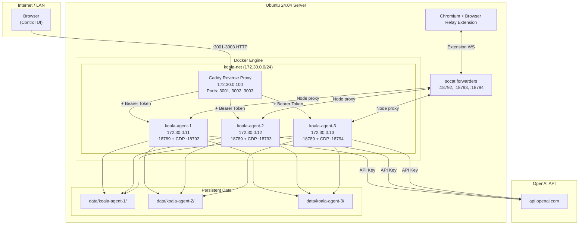

# KoalaClaw Installation Guide

> Deploy N specialized AI agents with a pixel art living office Web UI on a fresh Ubuntu 24.04 server.
> Includes 20 agent roles (with OrchestratorKoala), Wiro AI integration, workflow pipelines, monitoring, channel integrations, and gamification.

## Quick Install (Automated)

The fastest way to install KoalaClaw on a fresh Ubuntu server:

```bash
# Download the installer
curl -fsSL https://raw.githubusercontent.com/alicanti/koalaclaw/main/koalaclaw.sh -o koalaclaw.sh
chmod +x koalaclaw.sh

# Run interactive install (handles everything)
sudo ./koalaclaw.sh install
```

The installer will:
1. Check system requirements (OS, RAM, disk, ports)
2. Install Docker CE + Compose v2 if missing
3. Ask how many agents you want (1-50)
4. Let you select a role for each agent (20 roles available, including OrchestratorKoala)
5. Ask for your AI provider and API key
6. Validate the key and list available models
7. Optionally configure Wiro AI key (can also be done later in Settings)
8. Generate all config files, tokens, and deploy
9. Set up the Web UI on port 3099
10. Create `.settings.json` for Wiro/channel/model configuration

After install, the Web UI runs automatically as a systemd service (`koalaclaw-ui`).
Open `http://SERVER_IP:3099` in your browser.

## Post-Install: Settings Page

Click the **⚙️** button in the Web UI tab bar to open Settings:

- **Wiro AI**: Enter your API key and secret, test the connection, save.
- **Channel Integrations**: Connect Telegram (bot token), WhatsApp (QR login), Slack, or Discord to any agent. Use the sidebar **Channels** section to configure per-agent connections.
- **General**: Change the default AI model for all agents.

## Post-Install: Wiro AI

If you skipped the Wiro key during install, add it via Settings (⚙️) or the Integrations section in the sidebar. Once configured:

**How it works:** Agents with the `wiro-ai` skill (OrchestratorKoala, GenerativeKoala, DesignKoala) can generate images, videos, and audio. The flow is:
1. You ask the agent to generate something (e.g. "draw a space cat")
2. The system searches Wiro's marketplace using **multi-query discovery** (e.g. for video: searches `text-to-video`, `video-generation`, `image-to-video` simultaneously) and **suggests 2-3 models** with name, estimated cost, and average generation time
3. You pick a model by replying with **1, 2, or 3** — this is handled directly by code (no LLM round-trip), guaranteeing the correct model is used
4. The system fetches the model's documentation (`llms-full.txt`) to learn its input parameters
5. Builds the correct request body, submits the task, and polls until complete
6. Result appears inline in chat — images, videos, and audio render with player controls and a download button

**Auto-detect image-to-video:** Say "videoya cevir", "animate this", or "convert to video" and the system automatically finds the most recent image URL from chat history and uses it as input — no need to paste URLs.

**Media memory:** All generated media URLs are tracked across the full chat history (last 200 messages). The agent always knows what was previously generated.

**Supported video providers:** Seedance (ByteDance), KlingAI, Sora (OpenAI), Wan AI, PixVerse, MiniMax (Hailuo), Google Veo, Runway Gen4

**Quick test:** Open the "Wiro AI" section in the sidebar — it shows connection status, which agents have the skill, and a test input.

**Manual skill install:** To add the wiro-ai skill to any agent:
```bash
sudo koalaclaw skills add ./custom-skills/wiro-ai [agent-id]
```

## Asset Generation

Office visuals are pre-built as PNG files using Node.js scripts in `tools/`. To regenerate:

```bash
cd tools
npm install          # installs 'canvas' package
npm run generate     # generates koala sprite sheets + tileset
node generate-office-bg.js    # generates office background (768x576)
node generate-decorations.js  # generates 25 decoration sprites
```

Output goes to `ui/assets/`. These PNGs are committed to git — no build step needed for deployment.

## Post-Install: Image Upload

In the chat view, click the **📎** button to attach an image before sending a message. Images are displayed inline in the chat history.

## Post-Install: Vector DB & RAG

KoalaClaw includes a **Qdrant** vector database for persistent chat memory and document-based RAG:

- **Chat history** is automatically indexed in Qdrant. Use the **🔍** button in chat to semantically search past conversations.
- **Document upload**: Select an agent in the sidebar, open the **Documents** section, and drag & drop PDF/MD/TXT files. Documents are chunked, embedded, and indexed per agent.
- **RAG context**: When you chat with the orchestrator, it automatically retrieves relevant snippets from uploaded documents and includes them in the agent's context.
- **Per-agent isolation**: Each agent has separate `agent_{id}_chat` and `agent_{id}_docs` collections in Qdrant.

Qdrant runs as a Docker container (`koala-qdrant`) on the internal network at `172.30.0.200:6333`. Data is persisted in the `qdrant_data` Docker volume.

## Manual Install (Step by Step)

If you prefer to set things up manually, follow the sections below.

## Architecture

### System Overview



### Request Flow


### Docker Network Layout


### File Structure


### Troubleshooting Decision Tree


---

- **Caddy**: Reverse proxy + Bearer token auth injection
- **OpenClaw Agents**: Each runs independently with its own state directory
- **Docker Network**: Static-IP bridge network (required for trustedProxies)

---

## Prerequisites

- Ubuntu 24.04 LTS
- Docker & Docker Compose v2
- OpenAI API key (with billing credits)
- Root or sudo access

---

## 1. Install Docker (if not installed)

```bash
sudo apt update && sudo apt install -y ca-certificates curl gnupg
sudo install -m 0755 -d /etc/apt/keyrings
curl -fsSL https://download.docker.com/linux/ubuntu/gpg | sudo gpg --dearmor -o /etc/apt/keyrings/docker.gpg
sudo chmod a+r /etc/apt/keyrings/docker.gpg
echo "deb [arch=$(dpkg --print-architecture) signed-by=/etc/apt/keyrings/docker.gpg] https://download.docker.com/linux/ubuntu $(. /etc/os-release && echo "$VERSION_CODENAME") stable" | sudo tee /etc/apt/sources.list.d/docker.list > /dev/null
sudo apt update && sudo apt install -y docker-ce docker-ce-cli containerd.io docker-compose-plugin
sudo usermod -aG docker $USER
```

---

## 2. Create Directory Structure

```bash
sudo mkdir -p /home/$USER/koala-agent/data/koala-agent-{1,2,3}
cd /home/$USER/koala-agent
```

---

## 3. Generate Tokens

Generate a unique gateway token for each agent:

```bash
TOKEN1=$(openssl rand -hex 32)
TOKEN2=$(openssl rand -hex 32)
TOKEN3=$(openssl rand -hex 32)
echo "Agent 1 Token: $TOKEN1"
echo "Agent 2 Token: $TOKEN2"
echo "Agent 3 Token: $TOKEN3"
```

> Save these tokens. They are used in all configuration files below.

---

## 4. docker-compose.yml

Replace `<OPENAI_API_KEY>` and `<TOKEN>` placeholders with your own values:

```yaml
services:
  koala-agent-1:
    image: alpine/openclaw:latest
    container_name: koala-agent-1
    restart: unless-stopped
    environment:
      - OPENCLAW_GATEWAY_TOKEN=<TOKEN1>
      - OPENCLAW_STATE_DIR=/state
      - OPENAI_API_KEY=<OPENAI_API_KEY>
    volumes:
      - ./data/koala-agent-1:/state
    networks:
      koala-net:
        ipv4_address: 172.30.0.11
    healthcheck:
      test: ["CMD", "wget", "--spider", "-q", "--header=Authorization: Bearer <TOKEN1>", "http://127.0.0.1:18789/__openclaw__/canvas/"]
      interval: 15s
      timeout: 5s
      retries: 5
      start_period: 20s

  koala-agent-2:
    image: alpine/openclaw:latest
    container_name: koala-agent-2
    restart: unless-stopped
    environment:
      - OPENCLAW_GATEWAY_TOKEN=<TOKEN2>
      - OPENCLAW_STATE_DIR=/state
      - OPENAI_API_KEY=<OPENAI_API_KEY>
    volumes:
      - ./data/koala-agent-2:/state
    networks:
      koala-net:
        ipv4_address: 172.30.0.12
    healthcheck:
      test: ["CMD", "wget", "--spider", "-q", "--header=Authorization: Bearer <TOKEN2>", "http://127.0.0.1:18789/__openclaw__/canvas/"]
      interval: 15s
      timeout: 5s
      retries: 5
      start_period: 20s

  koala-agent-3:
    image: alpine/openclaw:latest
    container_name: koala-agent-3
    restart: unless-stopped
    environment:
      - OPENCLAW_GATEWAY_TOKEN=<TOKEN3>
      - OPENCLAW_STATE_DIR=/state
      - OPENAI_API_KEY=<OPENAI_API_KEY>
    volumes:
      - ./data/koala-agent-3:/state
    networks:
      koala-net:
        ipv4_address: 172.30.0.13
    healthcheck:
      test: ["CMD", "wget", "--spider", "-q", "--header=Authorization: Bearer <TOKEN3>", "http://127.0.0.1:18789/__openclaw__/canvas/"]
      interval: 15s
      timeout: 5s
      retries: 5
      start_period: 20s

  caddy:
    image: caddy:2-alpine
    container_name: koala-caddy
    restart: unless-stopped
    depends_on:
      koala-agent-1:
        condition: service_healthy
      koala-agent-2:
        condition: service_healthy
      koala-agent-3:
        condition: service_healthy
    ports:
      - "3001:3001"
      - "3002:3002"
      - "3003:3003"
    volumes:
      - ./Caddyfile:/etc/caddy/Caddyfile:ro
      - caddy_data:/data
      - caddy_config:/config
    networks:
      koala-net:
        ipv4_address: 172.30.0.100

networks:
  koala-net:
    driver: bridge
    ipam:
      config:
        - subnet: 172.30.0.0/24
          gateway: 172.30.0.1

volumes:
  caddy_data:
  caddy_config:
```

---

## 5. Caddyfile

```caddyfile
:3001 {
	reverse_proxy koala-agent-1:18789 {
		header_up Authorization "Bearer <TOKEN1>"
		header_up X-Forwarded-Proto "https"
	}
	log {
		output stderr
		level WARN
	}
}

:3002 {
	reverse_proxy koala-agent-2:18789 {
		header_up Authorization "Bearer <TOKEN2>"
		header_up X-Forwarded-Proto "https"
	}
	log {
		output stderr
		level WARN
	}
}

:3003 {
	reverse_proxy koala-agent-3:18789 {
		header_up Authorization "Bearer <TOKEN3>"
		header_up X-Forwarded-Proto "https"
	}
	log {
		output stderr
		level WARN
	}
}
```

---

## 6. OpenClaw Config (openclaw.json)

Create a separate `openclaw.json` for each agent. Replace `<SERVER_IP>`, `<PORT>`, and `<TOKEN>`:

**data/koala-agent-1/openclaw.json:**
```json
{
    "agents": {
        "defaults": {
            "model": {
                "primary": "openai/gpt-5.2"
            }
        }
    },
    "gateway": {
        "port": 18789,
        "bind": "lan",
        "controlUi": {
            "allowedOrigins": ["http://<SERVER_IP>:3001"],
            "allowInsecureAuth": true,
            "dangerouslyDisableDeviceAuth": true
        },
        "auth": {
            "token": "<TOKEN1>"
        },
        "trustedProxies": ["172.30.0.100"]
    }
}
```

**data/koala-agent-2/openclaw.json:** (same structure, use TOKEN2 and port 3002)

**data/koala-agent-3/openclaw.json:** (same structure, use TOKEN3 and port 3003)

> **Critical settings explained:**
> - `trustedProxies: ["172.30.0.100"]` — Caddy's static IP. **CIDR ranges are NOT supported**; use the exact IP address.
> - `allowInsecureAuth: true` — Allows Control UI access over plain HTTP.
> - `dangerouslyDisableDeviceAuth: true` — Disables browser device identity checks over HTTP.
> - `allowedOrigins` — Must match the browser origin exactly (including port).

---

## 7. Auth Profiles (API Key)

Create the auth-profiles file for each agent:

```bash
for i in 1 2 3; do
  mkdir -p data/koala-agent-$i/agents/main/agent
  cat > data/koala-agent-$i/agents/main/agent/auth-profiles.json << 'EOF'
{
  "version": 1,
  "profiles": {
    "openai": {
      "type": "api_key",
      "provider": "openai",
      "key": "<OPENAI_API_KEY>"
    }
  }
}
EOF
done
```

---

## 8. File Permissions

The OpenClaw container runs as `uid=1000 (node)`:

```bash
sudo chown -R 1000:1000 data/
chmod -R u+rwX,g+rwX,o-rwx data/
```

---

## 9. Start the Stack

```bash
cd /home/$USER/koala-agent
docker compose pull
docker compose up -d
```

Wait approximately 30 seconds for healthchecks to pass:

```bash
docker compose ps
```

All containers should show `(healthy)`.

---

## 10. Reset Device Identity (Required)

OpenClaw uses device pairing for CLI→Gateway communication. After a fresh deploy, stale device identity files can cause `"pairing required"` errors that block CLI commands and browser connections.

**Reset device identity and trigger auto-pairing:**

```bash
for i in 1 2 3; do
  # Remove stale device identity
  docker exec koala-agent-$i sh -c "rm -rf /state/identity/device.json /state/devices/"
  
  # Trigger auto-pairing via localhost (auto-approved)
  TOKEN=$(grep "OPENCLAW_GATEWAY_TOKEN" docker-compose.yml | sed -n "${i}p" | cut -d= -f2)
  docker exec koala-agent-$i node openclaw.mjs devices list \
    --url ws://127.0.0.1:18789 --token "$TOKEN"
done
```

> **Why localhost?** OpenClaw auto-approves pairing requests from `127.0.0.1`. Connections from Docker network IPs (e.g. `172.30.0.11`) are not considered "local" and require manual approval.

Verify pairing works:
```bash
docker exec koala-agent-1 node openclaw.mjs gateway status \
  --url ws://127.0.0.1:18789 --token <TOKEN1>
```

Expected: `RPC probe: ok`

---

## 11. Verify

```bash
# HTTP endpoint test
for port in 3001 3002 3003; do
  CODE=$(curl -s -o /dev/null -w "%{http_code}" http://localhost:$port/__openclaw__/canvas/)
  echo "Port $port -> HTTP $CODE"
done
```

Expected output: `HTTP 200` for each port.

---

## 12. Browser Access

Access the Control UI by passing the token in the URL hash:

```
http://<SERVER_IP>:3001/#token=<TOKEN1>
http://<SERVER_IP>:3002/#token=<TOKEN2>
http://<SERVER_IP>:3003/#token=<TOKEN3>
```

> The token is passed via `#` (hash fragment) so it is never sent to the server — only the browser JavaScript reads it.

---

## Automated Setup Script

Save the following as `setup.sh` and run it for a one-command deployment:

```bash
#!/bin/bash
set -euo pipefail

# ═══════════════════════════════════════
# CONFIGURATION - EDIT THESE VALUES
# ═══════════════════════════════════════
OPENAI_API_KEY="sk-proj-YOUR_KEY_HERE"
SERVER_IP="$(hostname -I | awk '{print $1}')"
INSTALL_DIR="/home/$USER/koala-agent"
MODEL="openai/gpt-5.2"

# Generate unique tokens
TOKEN1=$(openssl rand -hex 32)
TOKEN2=$(openssl rand -hex 32)
TOKEN3=$(openssl rand -hex 32)

echo "══════════════════════════════════════"
echo "  OpenClaw Multi-Agent Setup"
echo "  Server: $SERVER_IP"
echo "══════════════════════════════════════"

# Create directories
mkdir -p $INSTALL_DIR/data/koala-agent-{1,2,3}/agents/main/agent

# docker-compose.yml
cat > $INSTALL_DIR/docker-compose.yml << COMPOSEOF
services:
  koala-agent-1:
    image: alpine/openclaw:latest
    container_name: koala-agent-1
    restart: unless-stopped
    environment:
      - OPENCLAW_GATEWAY_TOKEN=$TOKEN1
      - OPENCLAW_STATE_DIR=/state
      - OPENAI_API_KEY=$OPENAI_API_KEY
    volumes:
      - ./data/koala-agent-1:/state
    networks:
      koala-net:
        ipv4_address: 172.30.0.11
    healthcheck:
      test: ["CMD", "wget", "--spider", "-q", "--header=Authorization: Bearer $TOKEN1", "http://127.0.0.1:18789/__openclaw__/canvas/"]
      interval: 15s
      timeout: 5s
      retries: 5
      start_period: 20s

  koala-agent-2:
    image: alpine/openclaw:latest
    container_name: koala-agent-2
    restart: unless-stopped
    environment:
      - OPENCLAW_GATEWAY_TOKEN=$TOKEN2
      - OPENCLAW_STATE_DIR=/state
      - OPENAI_API_KEY=$OPENAI_API_KEY
    volumes:
      - ./data/koala-agent-2:/state
    networks:
      koala-net:
        ipv4_address: 172.30.0.12
    healthcheck:
      test: ["CMD", "wget", "--spider", "-q", "--header=Authorization: Bearer $TOKEN2", "http://127.0.0.1:18789/__openclaw__/canvas/"]
      interval: 15s
      timeout: 5s
      retries: 5
      start_period: 20s

  koala-agent-3:
    image: alpine/openclaw:latest
    container_name: koala-agent-3
    restart: unless-stopped
    environment:
      - OPENCLAW_GATEWAY_TOKEN=$TOKEN3
      - OPENCLAW_STATE_DIR=/state
      - OPENAI_API_KEY=$OPENAI_API_KEY
    volumes:
      - ./data/koala-agent-3:/state
    networks:
      koala-net:
        ipv4_address: 172.30.0.13
    healthcheck:
      test: ["CMD", "wget", "--spider", "-q", "--header=Authorization: Bearer $TOKEN3", "http://127.0.0.1:18789/__openclaw__/canvas/"]
      interval: 15s
      timeout: 5s
      retries: 5
      start_period: 20s

  caddy:
    image: caddy:2-alpine
    container_name: koala-caddy
    restart: unless-stopped
    depends_on:
      koala-agent-1:
        condition: service_healthy
      koala-agent-2:
        condition: service_healthy
      koala-agent-3:
        condition: service_healthy
    ports:
      - "3001:3001"
      - "3002:3002"
      - "3003:3003"
    volumes:
      - ./Caddyfile:/etc/caddy/Caddyfile:ro
      - caddy_data:/data
      - caddy_config:/config
    networks:
      koala-net:
        ipv4_address: 172.30.0.100

networks:
  koala-net:
    driver: bridge
    ipam:
      config:
        - subnet: 172.30.0.0/24
          gateway: 172.30.0.1

volumes:
  caddy_data:
  caddy_config:
COMPOSEOF

# Caddyfile
cat > $INSTALL_DIR/Caddyfile << CADDYEOF
:3001 {
	reverse_proxy koala-agent-1:18789 {
		header_up Authorization "Bearer $TOKEN1"
		header_up X-Forwarded-Proto "https"
	}
	log {
		output stderr
		level WARN
	}
}

:3002 {
	reverse_proxy koala-agent-2:18789 {
		header_up Authorization "Bearer $TOKEN2"
		header_up X-Forwarded-Proto "https"
	}
	log {
		output stderr
		level WARN
	}
}

:3003 {
	reverse_proxy koala-agent-3:18789 {
		header_up Authorization "Bearer $TOKEN3"
		header_up X-Forwarded-Proto "https"
	}
	log {
		output stderr
		level WARN
	}
}
CADDYEOF

# openclaw.json per agent
TOKENS=($TOKEN1 $TOKEN2 $TOKEN3)
PORTS=(3001 3002 3003)
for i in 1 2 3; do
  idx=$((i-1))
  cat > $INSTALL_DIR/data/koala-agent-$i/openclaw.json << CFGEOF
{
    "agents": {
        "defaults": {
            "model": {
                "primary": "$MODEL"
            }
        }
    },
    "gateway": {
        "port": 18789,
        "bind": "lan",
        "controlUi": {
            "allowedOrigins": ["http://$SERVER_IP:${PORTS[$idx]}"],
            "allowInsecureAuth": true,
            "dangerouslyDisableDeviceAuth": true
        },
        "auth": {
            "token": "${TOKENS[$idx]}"
        },
        "trustedProxies": ["172.30.0.100"]
    }
}
CFGEOF

  # Auth profiles
  cat > $INSTALL_DIR/data/koala-agent-$i/agents/main/agent/auth-profiles.json << AUTHEOF
{
  "version": 1,
  "profiles": {
    "openai": {
      "type": "api_key",
      "provider": "openai",
      "key": "$OPENAI_API_KEY"
    }
  }
}
AUTHEOF
done

# Fix permissions (container runs as uid 1000)
sudo chown -R 1000:1000 $INSTALL_DIR/data/
chmod -R u+rwX,g+rwX,o-rwx $INSTALL_DIR/data/

# Deploy
cd $INSTALL_DIR
docker compose pull
docker compose up -d

echo ""
echo "Starting containers, waiting 30 seconds for healthchecks..."
sleep 30

# Verify
echo ""
echo "══════════════════════════════════════"
echo "  Test Results"
echo "══════════════════════════════════════"
docker compose ps
echo ""
for port in 3001 3002 3003; do
  CODE=$(curl -s -o /dev/null -w "%{http_code}" http://127.0.0.1:$port/__openclaw__/canvas/)
  echo "  Port $port -> HTTP $CODE"
done

echo ""
echo "══════════════════════════════════════"
echo "  Setup Complete!"
echo "══════════════════════════════════════"
echo ""
echo "  Access URLs:"
echo "    Agent 1: http://$SERVER_IP:3001/#token=$TOKEN1"
echo "    Agent 2: http://$SERVER_IP:3002/#token=$TOKEN2"
echo "    Agent 3: http://$SERVER_IP:3003/#token=$TOKEN3"
echo ""
echo "  Save your tokens!"
echo "  Model: $MODEL"
echo ""
```

Usage:
```bash
chmod +x setup.sh
# Edit OPENAI_API_KEY in the script, then:
sudo bash setup.sh
```

---

## Troubleshooting

### 502 Bad Gateway
- Containers may not be ready yet. Wait 30 seconds.
- Check healthcheck status with `docker compose ps`.
- Inspect startup logs with `docker logs koala-agent-1`.

### "device identity required"
- Ensure `dangerouslyDisableDeviceAuth: true` is set in `openclaw.json`.
- Clear browser cache.
- Make sure `#token=TOKEN` is present in the URL.

### "Proxy headers detected from untrusted address"
- `trustedProxies` must contain Caddy's **exact IP** (not a CIDR range): `["172.30.0.100"]`
- Static IP must be assigned in the Docker network config.

### "pairing required"
CLI commands (`gateway status`, `devices list`, `cron`) fail with `"pairing required"`.
- **Cause:** Stale device identity files from a previous session.
- **Fix:** Reset device identity and re-pair via localhost:
  ```bash
  docker exec koala-agent-1 sh -c "rm -rf /state/identity/device.json /state/devices/"
  docker exec koala-agent-1 node openclaw.mjs devices list \
    --url ws://127.0.0.1:18789 --token <TOKEN>
  ```
- Must connect via `127.0.0.1` (not Docker network IP) for auto-approve to work.

### "No API key found"
- `OPENAI_API_KEY` environment variable must be set in docker-compose.yml.
- `auth-profiles.json` must use the correct format (version + profiles + type + provider + key).

### Empty Responses (no chat reply)
- Check your OpenAI billing credits: https://platform.openai.com/account/billing
- Verify the model name is valid for your API key:
  ```bash
  curl -s https://api.openai.com/v1/models -H "Authorization: Bearer $OPENAI_API_KEY" | python3 -c "import sys,json; [print(m['id']) for m in json.load(sys.stdin)['data'] if 'gpt' in m['id']]"
  ```

### Container Logs
```bash
docker logs --tail=20 koala-agent-1
docker logs --tail=20 koala-caddy
```

### Full Restart
```bash
cd /home/$USER/koala-agent
docker compose down
docker compose up -d
```

---

## Important Notes

1. **`trustedProxies` does NOT support CIDR ranges.** OpenClaw source code uses exact IP matching: `normalizeIp(proxy) === normalized`. You must assign a static IP to Caddy in the Docker network.

2. **API keys must be provided as environment variables.** `OPENAI_API_KEY` is the official method (documented in `.env.example` inside the container).

3. **HTTP access requires two settings** in `openclaw.json` under `gateway.controlUi`:
   - `allowInsecureAuth: true`
   - `dangerouslyDisableDeviceAuth: true`

4. **Tokens are passed via URL hash:** `http://IP:PORT/#token=TOKEN`. The hash fragment is never sent to the server — only the browser JavaScript reads it for WebSocket authentication.

5. **Caddy `header_up Authorization`** works for HTTP requests only. WebSocket authentication is handled client-side by the browser JavaScript using the `#token=` URL hash.

6. **Device identity must be reset after fresh deploy.** OpenClaw generates a device keypair on first CLI connection. Stale files from previous sessions cause `"pairing required"` errors. Always delete `/state/identity/device.json` and `/state/devices/` after deploying, then reconnect via `ws://127.0.0.1:18789` (localhost) to trigger auto-pairing.

---

## Channels

OpenClaw supports 8 messaging channels out of the box. Each channel connects the AI agent to a different messaging platform.

### Supported Channels

| Channel | Method | Env Variable | Notes |
|---------|--------|-------------|-------|
| **Telegram** | Bot API | `TELEGRAM_BOT_TOKEN` | Easiest to set up — register a bot with @BotFather |
| **WhatsApp** | QR Link | *(QR scan via CLI)* | Uses your own number; recommend a separate phone + eSIM |
| **Discord** | Bot API | `DISCORD_BOT_TOKEN` | Very well supported |
| **Slack** | Socket Mode | `SLACK_BOT_TOKEN` + `SLACK_APP_TOKEN` | Socket Mode (no public URL needed) |
| **IRC** | Server + Nick | *(config in openclaw.json)* | Classic IRC networks with DM/channel routing |
| **Google Chat** | Chat API | *(config in openclaw.json)* | Google Workspace Chat app with HTTP webhook |
| **Signal** | signal-cli | *(linked device setup)* | signal-cli linked device; more complex setup |
| **iMessage** | imsg | *(macOS only)* | Work in progress |

### Setting Up a Channel

#### Telegram (Recommended for Quick Start)

1. Create a bot via [@BotFather](https://t.me/BotFather) on Telegram
2. Copy the bot token
3. Add to `docker-compose.yml` environment:
   ```yaml
   environment:
     - TELEGRAM_BOT_TOKEN=123456:ABCDEF...
   ```
4. Add to `openclaw.json`:
   ```json
   {
     "channels": {
       "telegram": {
         "enabled": true
       }
     }
   }
   ```
5. Restart the container: `docker compose restart koala-agent-1`

#### Discord

1. Create a Discord application at https://discord.com/developers/applications
2. Create a Bot and copy the token
3. Enable required Gateway Intents (Message Content, Server Members)
4. Invite bot to your server with appropriate permissions
5. Add to `docker-compose.yml` environment:
   ```yaml
   environment:
     - DISCORD_BOT_TOKEN=your_discord_bot_token
   ```
6. Add to `openclaw.json`:
   ```json
   {
     "channels": {
       "discord": {
         "enabled": true
       }
     }
   }
   ```

#### Slack

1. Create a Slack App at https://api.slack.com/apps
2. Enable Socket Mode and generate an App-Level Token (`xapp-...`)
3. Install the app to your workspace and get the Bot Token (`xoxb-...`)
4. Add to `docker-compose.yml` environment:
   ```yaml
   environment:
     - SLACK_BOT_TOKEN=xoxb-...
     - SLACK_APP_TOKEN=xapp-...
   ```

#### WhatsApp

WhatsApp requires an interactive QR scan. From inside the container:
```bash
docker exec -it koala-agent-1 node openclaw.mjs channels login --channel whatsapp
```
Scan the QR code with your phone's WhatsApp > Linked Devices.

### Channel Configuration in openclaw.json

```json
{
  "channels": {
    "telegram": {
      "enabled": true,
      "allowlist": ["+15555550123", "@username"],
      "defaultTarget": "@mychat"
    },
    "discord": {
      "enabled": true,
      "guildId": "123456789",
      "allowedChannels": ["general", "bot-commands"]
    }
  }
}
```

---

## Skills

Skills are modular capabilities that extend what the agent can do. OpenClaw ships with 50+ built-in skills.

### Available Skills

| Category | Skills |
|----------|--------|
| **Productivity** | `apple-notes`, `apple-reminders`, `bear-notes`, `notion`, `obsidian`, `things-mac`, `trello` |
| **Coding** | `coding-agent`, `github`, `skill-creator` |
| **Communication** | `discord`, `slack`, `imsg`, `voice-call` |
| **Media** | `openai-image-gen`, `openai-whisper`, `openai-whisper-api`, `spotify-player`, `songsee`, `video-frames`, `camsnap` |
| **AI/Models** | `gemini`, `oracle`, `summarize`, `model-usage` |
| **Browser** | `canvas`, `peekaboo`, `gifgrep` |
| **System** | `tmux`, `healthcheck`, `session-logs`, `weather`, `blogwatcher` |
| **Smart Home** | `openhue`, `sonoscli` |
| **Security** | `1password` |
| **Other** | `food-order`, `gog`, `goplaces`, `nano-pdf`, `sherpa-onnx-tts`, `clawhub` |

### Installing Skills

Skills are managed via the CLI or Control UI:

```bash
# Inside the container
docker exec -it koala-agent-1 node openclaw.mjs configure --section skills
```

Or via the onboard wizard:
```bash
docker exec -it koala-agent-1 node openclaw.mjs onboard --flow advanced
```

### Skill Configuration in openclaw.json

```json
{
  "skills": {
    "github": {
      "enabled": true
    },
    "weather": {
      "enabled": true,
      "defaultLocation": "Istanbul"
    }
  }
}
```

---

## Cron Jobs

Schedule recurring tasks for the agent:

```bash
# Add a daily summary cron job
docker exec -it koala-agent-1 node openclaw.mjs cron add \
  --schedule "0 9 * * *" \
  --message "Give me a daily news summary" \
  --target "+15555550123"
```

### Cron Configuration in openclaw.json

```json
{
  "cron": [
    {
      "schedule": "0 9 * * *",
      "message": "Daily briefing",
      "target": "+15555550123",
      "channel": "telegram"
    }
  ]
}
```

---

## Webhooks

OpenClaw can receive webhooks from external services:

```bash
# Webhook endpoint is available at:
# POST http://<SERVER_IP>:<PORT>/hooks/<hook_id>
# Authorization: Bearer <GATEWAY_TOKEN>
```

> Note: Webhook tokens must be provided via `Authorization: Bearer <token>` or `X-OpenClaw-Token` header. Query parameters are not allowed.

---

## Multiple Agents with Different Configs

Each agent in this setup is independent. You can configure them differently:

```
Agent 1: Telegram bot + coding-agent skill (developer assistant)
Agent 2: Discord bot + weather + summarize skills (community bot)
Agent 3: WhatsApp + cron jobs (personal assistant)
```

Simply customize each agent's `openclaw.json` and environment variables independently.

---

## Supported AI Providers

OpenClaw supports multiple AI providers. Set the appropriate environment variable:

| Provider | Env Variable | Model Format |
|----------|-------------|-------------|
| **OpenAI** | `OPENAI_API_KEY` | `openai/gpt-5.2`, `openai/gpt-4.1` |
| **Anthropic** | `ANTHROPIC_API_KEY` | `anthropic/claude-opus-4-6` |
| **Google** | `GEMINI_API_KEY` | `gemini/...` |
| **xAI** | `XAI_API_KEY` | `xai/grok-...` |
| **OpenRouter** | `OPENROUTER_API_KEY` | `openrouter/...` |
| **Together** | `TOGETHER_API_KEY` | `together/...` |
| **HuggingFace** | `HUGGINGFACE_API_KEY` | `huggingface/...` |
| **Moonshot/Kimi** | `MOONSHOT_API_KEY` | `moonshot/...` |
| **MiniMax** | `MINIMAX_API_KEY` | `minimax/...` |
| **Venice** | `VENICE_API_KEY` | `venice/...` |
| **Custom/Local** | `CUSTOM_API_KEY` | Custom base URL + model ID |

### Using Multiple Providers

Add multiple env variables to use fallback models:

```yaml
environment:
  - OPENAI_API_KEY=sk-...
  - ANTHROPIC_API_KEY=sk-ant-...
```

Then configure primary + fallback in `openclaw.json`:

```json
{
  "agents": {
    "defaults": {
      "model": {
        "primary": "openai/gpt-5.2",
        "fallbacks": ["anthropic/claude-opus-4-6"]
      }
    }
  }
}
```

---

## Messaging Commands

Send messages programmatically via the CLI:

```bash
# Send a text message
docker exec koala-agent-1 node openclaw.mjs message send \
  --target "+15555550123" \
  --message "Hello from OpenClaw"

# Send via Telegram
docker exec koala-agent-1 node openclaw.mjs message send \
  --channel telegram \
  --target "@mychat" \
  --message "Hello"

# Broadcast to multiple targets
docker exec koala-agent-1 node openclaw.mjs message broadcast \
  --targets "+1555,+1666,+1777" \
  --message "Announcement"

# Read recent messages
docker exec koala-agent-1 node openclaw.mjs message read \
  --channel discord \
  --target "channel:123456"
```

---

## Health & Monitoring

```bash
# Run health checks
docker exec koala-agent-1 node openclaw.mjs doctor

# Auto-fix common issues
docker exec koala-agent-1 node openclaw.mjs doctor --fix

# Check gateway status
docker exec koala-agent-1 node openclaw.mjs status

# View gateway health
docker exec koala-agent-1 node openclaw.mjs health
```

---

## Browser Relay (Remote Browser Control)

OpenClaw agents in Docker can control a real Chromium browser on the host server through the **Browser Relay** system. This enables web scraping, form filling, screenshots, and interactive browsing.

### Architecture

```mermaid
sequenceDiagram
    participant C as Chromium + Extension
    participant S as socat (host)
    participant N as Node proxy (container)
    participant R as CDP Relay (container)
    participant A as Agent

    Note over C: Extension installed + tab attached

    C->>S: ws://127.0.0.1:18792
    S->>N: TCP → container:18892
    N->>R: TCP → 127.0.0.1:18792
    R->>A: CDP commands available

    A->>R: browser.navigate("google.com")
    R->>N: CDP protocol
    N->>S: TCP forward
    S->>C: Execute in Chromium
    C-->>A: Result
```



### Why This Architecture?

The CDP relay inside the container binds to `127.0.0.1` only (security restriction). Docker port exposure forwards to the container's network IP (`172.30.0.x`), not to its loopback. The solution:

1. **Node.js TCP proxy** inside the container: `0.0.0.0:18892` → `127.0.0.1:18792`
2. **socat** on the host: `0.0.0.0:18792` → `container_ip:18892`
3. **Extension** connects to `127.0.0.1:18792` on the host

This preserves the Docker bridge network, Caddy routing, and all existing configuration.

> **Note:** The Node.js proxy script is stored at `/state/cdp-proxy.js` (persistent volume) so it survives container restarts. The socat forwarders are managed by a systemd service (`koalaclaw-relay`) for persistence across host reboots. If CDP stops working, run `sudo koalaclaw browser relay` to restart the full chain.

### Setup

KoalaClaw automatically installs the extension during `install`. If you need to set it up manually:

#### 1. Install the Browser Relay Extension

```bash
# Node.js 22+ required
curl -fsSL https://deb.nodesource.com/setup_22.x | bash -
apt-get install -y nodejs

# Install OpenClaw CLI and extension
npm install -g openclaw@latest
openclaw browser extension install

# Copy to accessible location
cp -r ~/.openclaw/browser/chrome-extension /opt/koalaclaw/browser-extension
chmod -R a+rX /opt/koalaclaw/browser-extension
```

#### 2. Load Extension in Chromium

1. Open Chromium on the server
2. Go to `chrome://extensions`
3. Enable **Developer mode** (top right toggle)
4. Click **"Load unpacked"**
5. Select `/opt/koalaclaw/browser-extension` (or wherever you copied it)
6. **Pin** the extension to the toolbar

#### 3. CDP Port Mapping

Each agent gets a unique CDP port:

| Agent | CDP Port | Extension connects to |
|-------|----------|----------------------|
| Agent 1 | `18792` | `http://127.0.0.1:18792` |
| Agent 2 | `18793` | `http://127.0.0.1:18793` |
| Agent 3 | `18794` | `http://127.0.0.1:18794` |

KoalaClaw sets up the relay chain automatically during `install`.

#### 4. Attach a Tab

1. Open a **normal web page** in Chromium (e.g. google.com)
   - ⚠️ Extension does NOT work on `chrome://` pages
2. Click the extension icon on the toolbar
3. Badge should show **"ON"** — tab is now attached
4. The agent can now control that tab

#### 5. Verify

```bash
# Check browser status
sudo koalaclaw browser status

# List attached tabs
sudo koalaclaw browser tabs

# Take a screenshot
sudo koalaclaw browser screenshot
```

### Browser Configuration in openclaw.json

```json
{
    "browser": {
        "enabled": true,
        "noSandbox": true,
        "attachOnly": true,
        "defaultProfile": "chrome",
        "profiles": {
            "chrome": {
                "cdpPort": 18792,
                "driver": "extension",
                "color": "#00AA00"
            }
        }
    }
}
```

### Relay Persistence

KoalaClaw creates a systemd service (`koalaclaw-relay`) that automatically restarts the socat forwarders on reboot:

```bash
# Check relay service
sudo systemctl status koalaclaw-relay

# Restart relay manually
sudo koalaclaw browser relay
```

### Browser Commands

```bash
# Start the browser
docker exec koala-agent-1 node openclaw.mjs browser start

# Check browser status
docker exec koala-agent-1 node openclaw.mjs browser status

# Open a URL
docker exec koala-agent-1 node openclaw.mjs browser open https://example.com

# Take a screenshot
docker exec koala-agent-1 node openclaw.mjs browser screenshot

# Full-page screenshot
docker exec koala-agent-1 node openclaw.mjs browser screenshot --full-page

# Take a page snapshot (AI-readable DOM)
docker exec koala-agent-1 node openclaw.mjs browser snapshot

# Click an element by ref
docker exec koala-agent-1 node openclaw.mjs browser click 12

# Type into an input field
docker exec koala-agent-1 node openclaw.mjs browser type 23 "hello" --submit

# Save page as PDF
docker exec koala-agent-1 node openclaw.mjs browser pdf

# List open tabs
docker exec koala-agent-1 node openclaw.mjs browser tabs

# Navigate to a URL
docker exec koala-agent-1 node openclaw.mjs browser navigate https://example.com

# Evaluate JavaScript on the page
docker exec koala-agent-1 node openclaw.mjs browser evaluate --fn '(el) => el.textContent' --ref 7
```

### Browser Profiles

```bash
# List profiles
docker exec koala-agent-1 node openclaw.mjs browser profiles

# Create a new profile
docker exec koala-agent-1 node openclaw.mjs browser create-profile --name "work"

# Use a specific profile
docker exec koala-agent-1 node openclaw.mjs browser open https://example.com --browser-profile work
```

---

## Memory & Knowledge Base

OpenClaw maintains a searchable memory index from workspace files. The agent can search its own memory for context.

```bash
# Check memory index status
docker exec koala-agent-1 node openclaw.mjs memory status

# Reindex memory files
docker exec koala-agent-1 node openclaw.mjs memory index

# Search memory
docker exec koala-agent-1 node openclaw.mjs memory search "deployment guide"
```

---

## Session Management

View and manage conversation sessions:

```bash
# List all sessions
docker exec koala-agent-1 node openclaw.mjs sessions

# List sessions active in the last 2 hours
docker exec koala-agent-1 node openclaw.mjs sessions --active 120

# JSON output for scripting
docker exec koala-agent-1 node openclaw.mjs sessions --json
```

Sessions track token usage per conversation. Set `agents.defaults.contextTokens` in `openclaw.json` to cap the context window.

---

## Agent Identity & Branding

Customize each agent's identity (name, emoji, avatar) displayed in the Control UI and messages:

```bash
# Set agent name and emoji
docker exec koala-agent-1 node openclaw.mjs agents set-identity \
  --agent main --name "Koala Bot" --emoji "🐨"

# Set avatar from a URL
docker exec koala-agent-1 node openclaw.mjs agents set-identity \
  --agent main --avatar "https://example.com/avatar.png"

# Load identity from IDENTITY.md in workspace
docker exec koala-agent-1 node openclaw.mjs agents set-identity \
  --workspace /home/node/.openclaw/workspace --from-identity
```

### IDENTITY.md

Create an `IDENTITY.md` in the agent's workspace to define its personality:

```markdown
# Koala Bot

You are a helpful assistant named Koala Bot.
You are friendly, professional, and always respond in English.
You specialize in DevOps and infrastructure tasks.
```

---

## Security Best Practices

### Token Rotation

Generate new tokens periodically:

```bash
NEW_TOKEN=$(openssl rand -hex 32)
# Update docker-compose.yml, Caddyfile, and openclaw.json with the new token
```

### Network Isolation

- Agent containers have **no published ports** — only Caddy exposes ports
- All inter-container traffic stays within the Docker bridge network
- Caddy injects Bearer tokens so agents never expose auth to the browser

### Firewall Rules

Restrict access to agent ports on the host:

```bash
# Allow only specific IPs to access Caddy ports
sudo ufw allow from 10.0.0.0/8 to any port 3001:3003 proto tcp
sudo ufw deny 3001:3003/tcp
```

### Separate API Keys

For production, use separate OpenAI API keys per agent to isolate billing and rate limits:

```yaml
# docker-compose.yml
koala-agent-1:
  environment:
    - OPENAI_API_KEY=sk-proj-agent1-key...

koala-agent-2:
  environment:
    - OPENAI_API_KEY=sk-proj-agent2-key...
```

---

## Backup & Restore

### Backup Agent Data

```bash
# Stop containers
cd /home/$USER/koala-agent
docker compose down

# Create backup
tar czf koala-agent-backup-$(date +%Y%m%d).tar.gz data/

# Restart
docker compose up -d
```

### Restore from Backup

```bash
docker compose down
tar xzf koala-agent-backup-20260215.tar.gz
sudo chown -R 1000:1000 data/
docker compose up -d
```

---

## Updating OpenClaw

```bash
cd /home/$USER/koala-agent

# Pull latest image
docker compose pull

# Recreate containers with new image
docker compose up -d --force-recreate

# Verify version
docker exec koala-agent-1 node openclaw.mjs --version
```

---

## Scaling: Adding More Agents

To add a 4th agent, append to `docker-compose.yml`:

```yaml
  koala-agent-4:
    image: alpine/openclaw:latest
    container_name: koala-agent-4
    restart: unless-stopped
    environment:
      - OPENCLAW_GATEWAY_TOKEN=<TOKEN4>
      - OPENCLAW_STATE_DIR=/state
      - OPENAI_API_KEY=<OPENAI_API_KEY>
    volumes:
      - ./data/koala-agent-4:/state
    networks:
      koala-net:
        ipv4_address: 172.30.0.14
    healthcheck:
      test: ["CMD", "wget", "--spider", "-q", "--header=Authorization: Bearer <TOKEN4>", "http://127.0.0.1:18789/__openclaw__/canvas/"]
      interval: 15s
      timeout: 5s
      retries: 5
      start_period: 20s
```

Add to Caddy:
```caddyfile
:3004 {
	reverse_proxy koala-agent-4:18789 {
		header_up Authorization "Bearer <TOKEN4>"
		header_up X-Forwarded-Proto "https"
	}
}
```

Publish the port in `caddy` service:
```yaml
    ports:
      - "3001:3001"
      - "3002:3002"
      - "3003:3003"
      - "3004:3004"
```

Create the data directory and `openclaw.json`, then `docker compose up -d`.

---

## Resource Limits (Production)

For production deployments, add resource limits to prevent runaway containers:

```yaml
  koala-agent-1:
    # ... existing config ...
    deploy:
      resources:
        limits:
          cpus: '2.0'
          memory: 2G
        reservations:
          cpus: '0.5'
          memory: 512M
```

---

## Logging

### Centralized Logging

Forward container logs to a logging service:

```yaml
  koala-agent-1:
    # ... existing config ...
    logging:
      driver: json-file
      options:
        max-size: "50m"
        max-file: "5"
```

### View Logs

```bash
# Follow all logs
docker compose logs -f

# Follow specific agent
docker compose logs -f koala-agent-1

# Last 100 lines
docker compose logs --tail=100 koala-agent-1

# OpenClaw internal log file (inside container)
docker exec koala-agent-1 cat /tmp/openclaw/openclaw-$(date +%Y-%m-%d).log
```

---

## Web UI Setup

KoalaClaw includes a web-based management dashboard.

### Prerequisites

- Python 3.8+ (usually pre-installed on Ubuntu 24.04)
- The KoalaClaw repo files (`ui/`, `roles/`, `admin-api.py`)

### Installation

```bash
# Clone the repo (or copy files to server)
git clone https://github.com/alicanti/koalaclaw.git /opt/koalaclaw-ui
cd /opt/koalaclaw-ui

# Start the Admin API (serves UI + REST API on port 3099)
python3 admin-api.py &

# Open in browser
# http://SERVER_IP:3099
```

### What the Web UI Provides

| Feature | Description |
|---------|-------------|
| Mission Control | Collapsible sidebar: Agents, Agent Files (Identity/Soul/Memory editor), Documents (RAG), Channels, Integrations (API keys), Wiro AI, System |
| Pixel Art Living Office | Phaser 3 office with pre-rendered 768x576 background, animated koala NPCs (32x32 sprites), A* pathfinding, NPC AI (coffee breaks, chatting, resting, celebrating), particle effects, day/night cycle, weather system, speech bubbles, and sprite-based layout editor with 25 decoration items |
| Orchestrated Chat | 🎯 Orchestrate toggle routes messages through OrchestratorKoala; live delegation chain shows each agent working in real time (SSE streaming) |
| Chat + Media | Send messages to any agent, attach images (📎), inline image/video/audio players, ⬇ download for all media |
| Admin Panel | Agent list, status, skill toggles, quick actions |
| Live Logs | Real-time, color-coded, filterable log stream |
| Workflows | Chain agents together (Blog Post, Product Launch, etc.) |
| Monitoring | CPU/RAM metrics, alert thresholds, cron jobs |
| Gamification | XP, levels (1-50), achievements, leaderboard, cosmetics |

### API Endpoints

| Endpoint | Method | Description |
|----------|--------|-------------|
| `/api/status` | GET | System status (online agents, model, version) |
| `/api/agents` | GET | All agents with live container status |
| `/api/agents/roster` | GET | Agent discovery (names, roles, status, orchestrator ID) |
| `/api/agents/{id}/logs` | GET | Recent logs for an agent |
| `/api/agents/{id}/history` | GET | Chat history for an agent |
| `/api/agents/{id}/files` | GET | List editable agent files |
| `/api/agents/{id}/files/{path}` | GET/POST | Read/write agent files (Identity, Soul, etc.) |
| `/api/agents/chat` | POST | Send a message to an agent |
| `/api/agents/orchestrate` | POST | SSE streaming orchestration (analyze → delegate → combine) |
| `/api/agents/delegate` | POST | Direct agent-to-agent delegation |
| `/api/agents/broadcast` | POST | Send message to multiple agents |
| `/api/integrations` | GET | List configured API key providers |
| `/api/integrations/{provider}` | POST/DELETE | Save or remove an API key |
| `/api/integrations/{provider}/test` | POST | Test provider connection |
| `/api/system/info` | GET | System metrics (uptime, disk, memory) |
| `/api/system/restart-all` | POST | Restart all agent containers |
| `/api/roles` | GET | All 20 available roles |
| `/api/stats` | GET | Docker container resource usage |
| `/api/config` | GET | System configuration (safe, no secrets) |
| `/api/wiro/status` | GET | Wiro connection status and skill agents |
| `/api/wiro/models` | GET | Search Wiro models via Tool/List API |
| `/api/wiro/generate` | POST | Generate with specific model (auto-parses docs) |
| `/api/wiro/smart-generate` | POST | Auto-find best model + generate |
| `/api/agents/{id}/history/search` | GET | Semantic search over chat history (Qdrant) |
| `/api/agents/{id}/documents` | GET/POST | List or upload documents for RAG |
| `/api/agents/{id}/documents/{name}` | DELETE | Delete a document |
| `/api/agents/{id}/documents/search` | POST | Semantic search over uploaded documents |
| `/api/agents/{id}/channels` | GET | List all channel statuses for an agent |
| `/api/agents/{id}/channels/{name}` | POST | Configure/connect a channel (Telegram/WhatsApp/Slack/Discord) |
| `/api/agents/{id}/channels/{name}/status` | GET | Check single channel connection status |
| `/api/settings` | GET/POST | General settings (Wiro keys, channels, model) |

### Running as a Service

To keep the Web UI running after logout:

```bash
# Create systemd service
cat > /etc/systemd/system/koalaclaw-ui.service << 'EOF'
[Unit]
Description=KoalaClaw Web UI
After=network.target docker.service

[Service]
Type=simple
WorkingDirectory=/opt/koalaclaw-ui
ExecStart=/usr/bin/python3 admin-api.py
Restart=always
User=root
Environment=KOALACLAW_INSTALL_DIR=/opt/koalaclaw

[Install]
WantedBy=multi-user.target
EOF

systemctl daemon-reload
systemctl enable --now koalaclaw-ui
```

### Firewall

If UFW is active, open port 3099:

```bash
sudo ufw allow 3099/tcp
```

---

## Agent Roles

KoalaClaw includes 19 pre-built agent roles. During installation, you select a role for each agent.

### Role Files

Each role is defined in `roles/<role-name>/`:

| File | Purpose |
|------|---------|
| `IDENTITY.md` | Name, emoji, personality, speaking style |
| `SOUL.md` | Mission, core rules, boundaries, decision framework |
| `skills.json` | Which OpenClaw skills to enable |
| `channels.json` | Messaging channel configuration |
| `desk.json` | Office desk decorations for the Web UI |
| `gamification.json` | XP skill tree and achievement definitions |

### Available Roles

**Core (6):** CoderKoala, MarketerKoala, StrategyKoala, CustomerKoala, GenerativeKoala, ResearchKoala

**Extended (6):** DataKoala, DevOpsKoala, FinanceKoala, ContentKoala, SecurityKoala, SchedulerKoala

**Advanced (6):** TranslatorKoala, LegalKoala, HRKoala, SalesKoala, QAKoala, DesignKoala

**Custom (1):** CustomKoala (user-defined)

### Creating a Custom Role

```bash
mkdir -p roles/my-custom-role
# Create IDENTITY.md, SOUL.md, skills.json, desk.json, gamification.json
# See any existing role as a template
```

---

## Custom Skills

KoalaClaw includes 13 pre-built custom skill templates in `custom-skills/`:

| Skill | Used By | API |
|-------|---------|-----|
| **wiro-ai** | **OrchestratorKoala, GenerativeKoala, DesignKoala** | **Wiro AI (smart model discovery + generation)** |
| twitter-api | MarketerKoala | Twitter API v2 |
| reddit-api | MarketerKoala | Reddit OAuth |
| email-responder | CustomerKoala, SalesKoala, HRKoala | IMAP/SMTP |
| replicate-api | GenerativeKoala | Replicate |
| elevenlabs-tts | GenerativeKoala | ElevenLabs |
| web-scraper | ResearchKoala | Readability + fetch |
| csv-analyzer | DataKoala | Python/Node |
| server-monitor | DevOpsKoala | /proc, ss, df |
| crypto-tracker | FinanceKoala | CoinGecko |
| seo-writer | ContentKoala | Google Search |
| vuln-scanner | SecurityKoala | nmap, SSL check |
| calendar-sync | SchedulerKoala | CalDAV / Google Calendar |

### Adding a Custom Skill

Create a folder with a `SKILL.md`:

```bash
mkdir -p custom-skills/my-skill
cat > custom-skills/my-skill/SKILL.md << 'EOF'
# My Custom Skill

## Description
What this skill does.

## Capabilities
- Capability 1
- Capability 2

## Usage
Instructions for the AI agent.
EOF

# Add to agents
sudo koalaclaw skills add ./custom-skills/my-skill
```

---

## Workflow Pipelines

KoalaClaw includes 4 preset workflow pipelines in `workflows/`:

1. **Blog Post Pipeline** — Research → Write → SEO → Social Media
2. **Customer Onboarding** — Welcome Email → Schedule Call → CRM Entry
3. **Security Audit** — Port Scan → SSL Check → Config Review → Compliance Report
4. **Product Launch** — Strategy → Content → Marketing → Sales → Schedule

Workflows are accessible from the Web UI via the "Workflows" button.

### Creating a Custom Workflow

```json
{
  "name": "My Workflow",
  "description": "Description of what this workflow does",
  "steps": [
    {"agent_role": "research-koala", "task": "Research {{topic}}"},
    {"agent_role": "content-koala", "task": "Write about findings", "input_from": [0]}
  ],
  "variables": {
    "topic": "What to research"
  }
}
```

Save as `workflows/my-workflow.json`.
