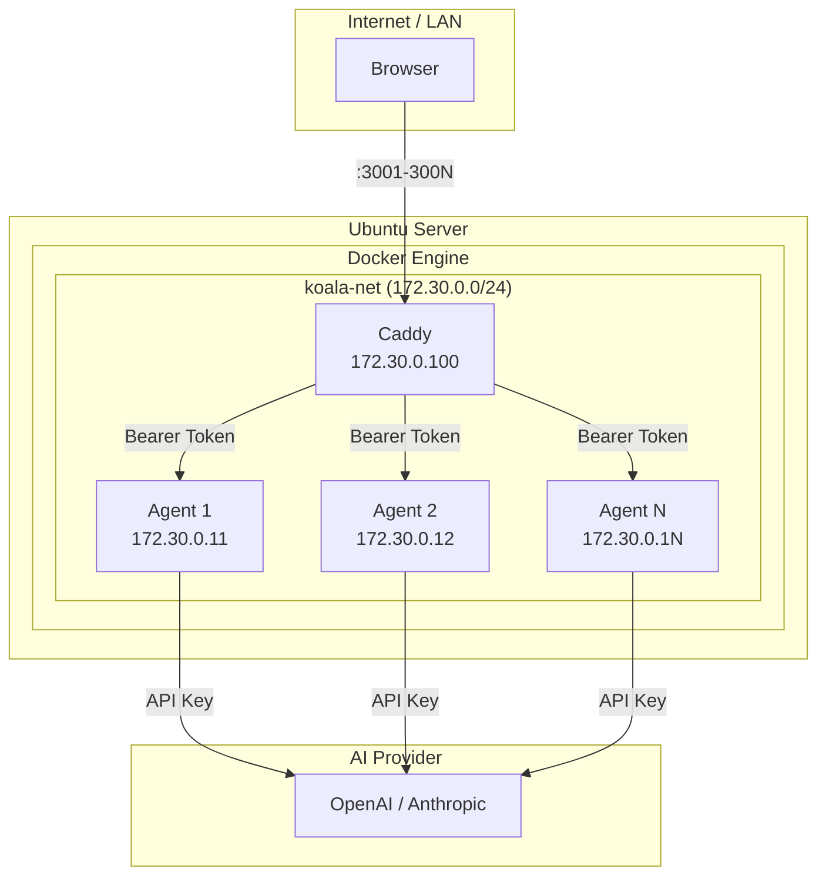
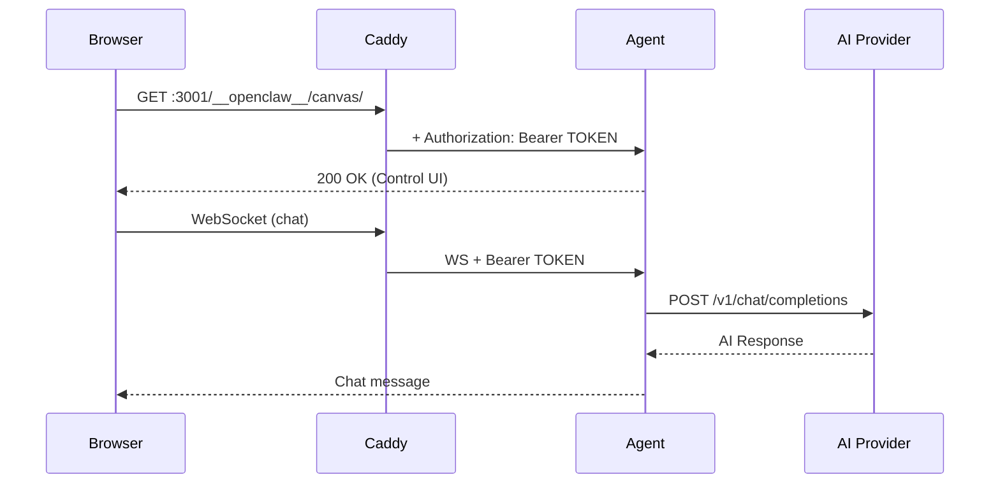

<div align="center">

<br>

```
                ⢀⠔⠊⠉⠑⢄⠀⠀⣀⣀⠤⠤⠤⢀⣀⠀⠀⣀⠔⠋⠉⠒⡄⠀
                ⡎⠀⠀⠀⠀⠀⠀⠁⠀⠀⠀⠀⠀⠀⠀⠀⠉⠀⠀⠀⠀⠀⠘⡄
                ⣧⢢⠀⠀⠀⠀⠀⠀⠀⠀⣀⣄⠀⠀⠀⠀⠀⠀⠀⠀⠀⢈⣆⡗
                ⠘⡇⠀⢀⠆⠀⠀⣀⠀⢰⣿⣿⣧⠀⢀⡀⠀⠀⠘⡆⠀⠈⡏⠀
                ⠀⠑⠤⡜⠀⠀⠈⠋⠀⢸⣿⣿⣿⠀⠈⠃⠀⠀⠀⠸⡤⠜⠀⠀
                ⠀⠀⠀⣇⠀⠀⠀⠀⠀⠢⣉⢏⣡⠀⠀⠀⠀⠀⠀⢠⠇⠀⠀⠀
                ⠀⠀⠀⠈⠢⡀⠀⠀⠀⠀⠀⠀⠀⠀⠀⠀⠀⢀⡤⠋⠀⠀⠀⠀
                ⠀⠀⠀⠀⠀⢨⠃⠀⢀⠀⢀⠔⡆⠀⠀⠀⠀⠻⡄⠀⠀⠀⠀⠀
                ⠀⠀⠀⠀⠀⡎⠀⠀⠧⠬⢾⠊⠀⠀⢀⡇⠀⠀⠟⢆⠀⠀⠀⠀
                ⠀⠀⠀⠀⢀⡇⠀⠀⡞⠀⠀⢣⣀⡠⠊⠀⠀⠀⢸⠈⣆⡀⠀⠀
                ⠀⠀⡠⠒⢸⠀⠀⠀⡇⡠⢤⣯⠅⠀⠀⠀⢀⡴⠃⠀⢸⠘⢤⠀
                ⠀⢰⠁⠀⢸⠀⠀⠀⣿⠁⠀⠙⡟⠒⠒⠉⠀⠀⠀⠀⠀⡇⡎⠀
                ⠀⠘⣄⠀⠸⡆⠀⠀⣿⠀⠀⠀⠁⠀⠀⠀⠀⠀⠀⠀⢀⠟⠁⠀
                ⠀⠀⠘⠦⣀⣷⣀⡼⠽⢦⡀⠀⠀⢀⣀⣀⣀⠤⠄⠒⠁⠀⠀⠀
```

<h1>🦞 KoalaClaw 🐨</h1>

<h3>Deploy OpenClaw AI agents on any Ubuntu server<br>with a single command.</h3>

<br>

<p>
<a href="LICENSE"></a>
<a href="https://ubuntu.com"></a>
<a href="https://docker.com"></a>
<a href="https://openclaw.ai"></a>
</p>

<p>
<a href="#-quick-start">Quick Start</a> · 
<a href="#-features">Features</a> · 
<a href="#-commands">Commands</a> · 
<a href="#-architecture">Architecture</a> · 
<a href="#-faq">FAQ</a>
</p>

<br>


<br><br>

</div>

---

## ⚡ Quick Start

```bash
# Download
curl -fsSL https://raw.githubusercontent.com/alicanti/koalaclaw/main/koalaclaw.sh -o koalaclaw.sh
chmod +x koalaclaw.sh

# Install (interactive)
sudo ./koalaclaw.sh install
```

That's it. The installer handles **everything** — Docker, networking, reverse proxy, tokens, permissions, healthchecks.

---

## 🎯 What is KoalaClaw?

KoalaClaw deploys multiple [OpenClaw](https://openclaw.ai) AI agents behind a [Caddy](https://caddyserver.com) reverse proxy on a fresh Ubuntu server. Each agent is fully isolated with its own configuration, auth token, and data directory.

```
Internet / LAN
     │
     ├── :3001 → Caddy → koala-agent-1 (OpenClaw)
     ├── :3002 → Caddy → koala-agent-2 (OpenClaw)
     ├── :3003 → Caddy → koala-agent-3 (OpenClaw)
     └── :300N → Caddy → koala-agent-N (OpenClaw)
```

### Why?

- **One command** deploys N isolated AI agents on any Ubuntu box
- **Zero config files** to write manually — the installer generates everything
- **Scale up/down** anytime with `add-agent` / `remove-agent`
- **Production-ready** — healthchecks, auto-restart, log rotation, backups

---

## ✨ Features

### Installation
- 🐳 **Auto-installs Docker** CE + Compose v2 if missing
- 🔍 **Pre-flight checks** — OS, RAM, disk, ports, firewall, subnet, internet
- 🔑 **API key validation** — tests your key before deploying
- 📋 **Model discovery** — lists available models for your API key
- 🛡️ **Firewall handling** — auto-opens UFW ports (with confirmation)

### Operations
- ➕ **Add agents** without downtime (existing agents keep running)
- ➖ **Remove agents** safely (data preserved)
- 📊 **Status dashboard** — container health + HTTP checks at a glance
- 🔄 **One-command updates** — pull latest images and restart
- 💾 **Backup & restore** — tar.gz archives with all config and data

### Security
- 🎲 **Unique tokens** per agent (256-bit, auto-generated)
- 🔒 **Credentials file** with `chmod 600`
- 🌐 **Network isolation** — agents have no published ports, only Caddy is exposed
- 🏠 **Static IPs** in Docker network for reliable `trustedProxies`

---

## 🔧 Commands

| Command | Description |
|---------|-------------|
| `install` | Full interactive setup from scratch |
| `add-agent` | Add more agents to existing deployment |
| `remove-agent [N]` | Remove a specific agent |
| `status` | Show health of all agents |
| `credentials` | Display access URLs and tokens |
| `logs [N]` | View logs (all agents or specific) |
| `update` | Pull latest OpenClaw images and restart |
| `backup` | Create a backup archive |
| `restore <file>` | Restore from a backup |
| `uninstall` | Remove containers and optionally data |
| `dry-run` | Preview what install would do |

### Examples

```bash
# Deploy 5 agents with GPT-5.2
sudo koalaclaw install

# Check everything is running
sudo koalaclaw status

# Add 2 more agents
sudo koalaclaw add-agent

# View agent 1 logs
sudo koalaclaw logs 1

# Backup before maintenance
sudo koalaclaw backup

# Update OpenClaw to latest version
sudo koalaclaw update

# Show access URLs
sudo koalaclaw credentials
```

---

## 🏗️ Architecture



### Request Flow



### File Structure

```
/opt/koalaclaw/
├── koalaclaw.sh           # CLI tool
├── .koalaclaw.state       # State (tokens, config)
├── .credentials           # Access URLs & tokens
├── docker-compose.yml     # Generated
├── Caddyfile              # Generated
└── data/
    ├── koala-agent-1/
    │   ├── openclaw.json
    │   └── agents/main/agent/
    │       └── auth-profiles.json
    ├── koala-agent-2/
    │   └── ...
    └── koala-agent-N/
        └── ...
```

---

## 📋 Requirements

| Requirement | Minimum |
|-------------|---------|
| OS | Ubuntu 22.04 / 24.04 LTS |
| RAM | 1 GB + ~400 MB per agent |
| Disk | 5 GB free |
| Network | Internet access (Docker Hub + AI API) |
| Privileges | Root / sudo |

Docker is installed automatically if not present.

---

## 🤖 Supported AI Providers

| Provider | Env Variable | Model Example |
|----------|-------------|---------------|
| OpenAI | `OPENAI_API_KEY` | `openai/gpt-5.2` |
| Anthropic | `ANTHROPIC_API_KEY` | `anthropic/claude-sonnet-4-5` |
| Custom | `OPENAI_API_KEY` | Any OpenAI-compatible endpoint |

The installer validates your API key and lists available models before deploying.

---

## 🔌 OpenClaw Features

Each deployed agent supports the full OpenClaw feature set:

### Channels
Connect agents to messaging platforms:

| Channel | Setup |
|---------|-------|
| Telegram | Bot token via env var |
| WhatsApp | QR code scan via CLI |
| Discord | Bot token via env var |
| Slack | Socket Mode tokens |
| IRC | Server config |
| Signal | Linked device |

### Skills (50+)
Built-in capabilities including: `coding-agent`, `github`, `notion`, `trello`, `openai-image-gen`, `weather`, `spotify-player`, `voice-call`, `1password`, and more.

### Browser Automation
Headless Chrome for web scraping, screenshots, form filling, and more.

### Cron Jobs
Schedule recurring tasks for agents.

See [INSTALLATION.md](INSTALLATION.md) for full configuration details.

---

## ❓ FAQ

<details>
<summary><b>Can I use different models per agent?</b></summary>

Yes! Use `add-agent` and choose a different model, or edit each agent's `openclaw.json` directly:

```json
{
  "agents": {
    "defaults": {
      "model": {
        "primary": "openai/gpt-4.1"
      }
    }
  }
}
```
</details>

<details>
<summary><b>Can I use different API keys per agent?</b></summary>

Yes. Use `add-agent` with `n` when asked "Use same API key?" — or edit `docker-compose.yml` environment variables.
</details>

<details>
<summary><b>How do I access the Control UI?</b></summary>

Open in your browser:
```
http://SERVER_IP:3001/#token=YOUR_TOKEN
```
The token is passed via URL hash (never sent to server). Run `koalaclaw credentials` to see all URLs.
</details>

<details>
<summary><b>How do I add HTTPS?</b></summary>

Put a real domain in front of Caddy, or use Cloudflare Tunnel / Tailscale Funnel. The current setup uses `X-Forwarded-Proto: https` header to satisfy OpenClaw's secure context requirement over plain HTTP.
</details>

<details>
<summary><b>What if my API key has no credits?</b></summary>

The installer warns you during setup. Chat will appear to work (WebSocket connects, messages send) but responses will be empty. Add credits at https://platform.openai.com/account/billing.
</details>

<details>
<summary><b>Can I run this on Debian / other distros?</b></summary>

The script is tested on Ubuntu 22.04/24.04. It will attempt to run on Debian with a warning. Other distros are not supported.
</details>

<details>
<summary><b>How do I scale to 10+ agents?</b></summary>

```bash
sudo koalaclaw add-agent
# Enter: 7 (to go from 3 to 10)
```
Each agent needs ~400MB RAM. For 10 agents, ensure at least 5GB RAM.
</details>

---

## 🧯 Troubleshooting

| Problem | Solution |
|---------|----------|
| 502 Bad Gateway | Wait 30s for healthchecks. Run `koalaclaw status` |
| Empty chat responses | Check API billing credits |
| "device identity required" | Ensure URL has `#token=TOKEN` |
| "pairing required" | Reset device identity (see below) |
| "untrusted proxy" | Caddy must have static IP in `trustedProxies` |
| Port already in use | Choose different starting port during install |
| Docker pull fails | Check internet / DNS connectivity |

### "pairing required" — CLI commands fail

OpenClaw uses device pairing for CLI→Gateway auth. Stale device files cause this error.

```bash
# Reset device identity inside the container
docker exec koala-agent-1 sh -c "rm -rf /state/identity/device.json /state/devices/"

# Re-pair via localhost (auto-approved)
docker exec koala-agent-1 node openclaw.mjs devices list \
  --url ws://127.0.0.1:18789 --token <YOUR_TOKEN>
```

> **Important:** Must connect via `127.0.0.1`, not the Docker network IP. Only localhost connections get auto-approved pairing. KoalaClaw's `install`, `add-agent`, and `update` commands handle this automatically.

For detailed logs:
```bash
sudo koalaclaw logs 1
```

---

## 📄 License

MIT License. See [LICENSE](LICENSE) for details.

---

<div align="center">

**Built with 🐨🦞 by [Alican Tilki](https://github.com/alicanti)**

*Deploy AI agents like a koala with claws.*

</div>

