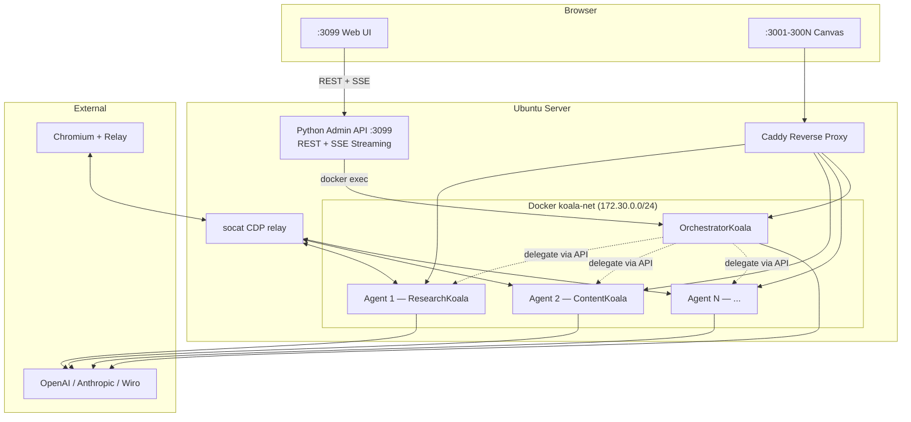

<div align="center">

<br>

```
                ⢀⠔⠊⠉⠑⢄⠀⠀⣀⣀⠤⠤⠤⢀⣀⠀⠀⣀⠔⠋⠉⠒⡄⠀
                ⡎⠀⠀⠀⠀⠀⠀⠁⠀⠀⠀⠀⠀⠀⠀⠀⠉⠀⠀⠀⠀⠀⠘⡄
                ⣧⢢⠀⠀⠀⠀⠀⠀⠀⠀⣀⣄⠀⠀⠀⠀⠀⠀⠀⠀⠀⢈⣆⡗
                ⠘⡇⠀⢀⠆⠀⠀⣀⠀⢰⣿⣿⣧⠀⢀⡀⠀⠀⠘⡆⠀⠈⡏⠀
                ⠀⠑⠤⡜⠀⠀⠈⠋⠀⢸⣿⣿⣿⠀⠈⠃⠀⠀⠀⠸⡤⠜⠀⠀
                ⠀⠀⠀⣇⠀⠀⠀⠀⠀⠢⣉⢏⣡⠀⠀⠀⠀⠀⠀⢠⠇⠀⠀⠀
                ⠀⠀⠀⠈⠢⡀⠀⠀⠀⠀⠀⠀⠀⠀⠀⠀⠀⢀⡤⠋⠀⠀⠀⠀
                ⠀⠀⠀⠀⠀⢨⠃⠀⢀⠀⢀⠔⡆⠀⠀⠀⠀⠻⡄⠀⠀⠀⠀⠀
                ⠀⠀⠀⠀⠀⡎⠀⠀⠧⠬⢾⠊⠀⠀⢀⡇⠀⠀⠟⢆⠀⠀⠀⠀
                ⠀⠀⠀⠀⢀⡇⠀⠀⡞⠀⠀⢣⣀⡠⠊⠀⠀⠀⢸⠈⣆⡀⠀⠀
                ⠀⠀⡠⠒⢸⠀⠀⠀⡇⡠⢤⣯⠅⠀⠀⠀⢀⡴⠃⠀⢸⠘⢤⠀
                ⠀⢰⠁⠀⢸⠀⠀⠀⣿⠁⠀⠙⡟⠒⠒⠉⠀⠀⠀⠀⠀⡇⡎⠀
                ⠀⠘⣄⠀⠸⡆⠀⠀⣿⠀⠀⠀⠁⠀⠀⠀⠀⠀⠀⠀⢀⠟⠁⠀
                ⠀⠀⠘⠦⣀⣷⣀⡼⠽⢦⡀⠀⠀⢀⣀⣀⣀⠤⠄⠒⠁⠀⠀⠀
```

<h1>🦞 KoalaClaw 🐨</h1>

<h3>AI Agent Management Platform<br>Deploy, manage, and gamify OpenClaw agents with an isometric office UI.</h3>

<br>

<p>
<a href="LICENSE"></a>
<a href="https://ubuntu.com"></a>
<a href="https://docker.com"></a>
<a href="https://openclaw.ai"></a>
</p>

<p>
<a href="#-quick-start">Quick Start</a> · 
<a href="#-features">Features</a> · 
<a href="#-19-agent-roles">Roles</a> · 
<a href="#-commands">Commands</a> · 
<a href="#-web-ui">Web UI</a> · 
<a href="#-architecture">Architecture</a> · 
<a href="#-faq">FAQ</a>
</p>

<br>

</div>

---

## ⚡ Quick Start

```bash
# Download
curl -fsSL https://raw.githubusercontent.com/alicanti/koalaclaw/main/koalaclaw.sh -o koalaclaw.sh
chmod +x koalaclaw.sh

# Install (interactive — asks agent count, roles, API key, model)
sudo ./koalaclaw.sh install

# Open the Web UI
# http://SERVER_IP:3099
```

The installer handles **everything** — Docker, networking, reverse proxy, role assignment (Agent 1 is always **OrchestratorKoala** as manager; you choose roles for agents 2 and up), tokens, permissions, healthchecks, and the web dashboard.

---

## 🎯 What is KoalaClaw?

KoalaClaw is a full AI agent management platform built on [OpenClaw](https://openclaw.ai). It deploys N specialized AI agents behind a [Caddy](https://caddyserver.com) reverse proxy, each with a unique role, personality, and skill set. A web-based isometric office UI lets you manage, chat with, and monitor all agents in real time.

```
Internet / LAN
     │
     ├── :3001 → Caddy → 💻 CoderKoala     (coding, review, deploy)
     ├── :3002 → Caddy → 📣 MarketerKoala  (social media, campaigns)
     ├── :3003 → Caddy → 🧠 StrategyKoala  (planning, OKRs)
     ├── :300N → Caddy → 🐨 AnyKoala       (your choice of 20 roles)
     └── :3099 → Admin API → 🎮 Web UI     (isometric office dashboard)
```

---

## ✨ Features

### 20 Specialized Agent Roles
Each agent gets a unique personality (IDENTITY.md), behavior rules (SOUL.md), pre-configured skills, desk decorations, and a gamification skill tree. Includes an **OrchestratorKoala** that delegates complex tasks to specialist agents.

### Isometric Office Web UI
A browser-based dashboard at `:3099` with:
- **Mission Control sidebar** — collapsible panel (320px ↔ 60px) with Agents, Agent Files (Identity/Soul/Memory/Protocol editor), Integrations (OpenAI, Anthropic, Wiro, etc.), and System (restart, backup)
- **Animated office** — canvas overlay with procedural pixel koalas, dust particles, coffee steam, thinking sparkles, screen glow, and day/night tint
- **Isometric office** — manager room at the top (OrchestratorKoala at a larger executive desk), glass divider, then open office with other agents at desks; hover tooltips and desk click zoom
- **Live character animations** — idle, thinking, typing, browsing, talking, error, sleeping (DOM + canvas sprites)
- **Admin panel** — agent list, status, skill toggles, quick actions
- **Chat with media support** — talk to any agent, attach images (📎), generated images/videos/audio render inline with player controls and ⬇ download button
- **Orchestrate mode** — toggle 🎯 in chat to route messages through OrchestratorKoala with live delegation chain
- **Wiro AI skill** — agents with the `wiro-ai` skill can generate images/video/audio; they auto-discover models via Wiro API, read model docs, and build correct parameters
- **Wiro AI status panel** — sidebar shows connection status, which agents have the skill, and a quick test input
- **Settings page** — configure Wiro API keys, channel integrations, default model (⚙️)
- **Live logs** — color-coded, filterable, real-time log stream
- **Workflow pipelines** — chain agents together (Blog Post, Product Launch, Security Audit)
- **Monitoring dashboard** — CPU/RAM per agent, alerts, cron jobs
- **Gamification** — XP, levels (1-50), achievements, leaderboard, outfits, desk rewards

### Wiro AI Skill (Smart Generation)
Connect to [Wiro AI](https://wiro.ai) for 500+ generative models. Agents with the `wiro-ai` skill handle generation with a two-step flow:

1. **Model suggestions** — when you ask to generate something, the agent searches Wiro's marketplace, ranks models by speed/quality/cost, and presents 2-3 options with estimated cost and average generation time
2. **User picks a model** — reply with a number (1, 2, or 3) to select
3. **Documentation parsing** — fetches the chosen model's `llms-full.txt` to learn its exact input parameters
4. **Smart parameter building** — detects prompt fields, applies defaults, passes input images for image-to-video
5. **Generate & poll** — submits the task and polls until complete, returns the output URL

Generated content appears inline in chat: images as ``, videos as `<video>` player, audio as `<audio>` player — all with a ⬇ download button. For image-to-video, the agent automatically uses the previously generated image as input.

### Inter-Agent Communication & Orchestration
OrchestratorKoala analyzes complex requests, breaks them into sub-tasks, and delegates to specialist agents in real time. The orchestration uses **Server-Sent Events (SSE)** so you see each step live in the chat:

1. **Analyzing** — Orchestrator decides which agents to involve (or answers directly for simple questions)
2. **Delegating** — Each agent works on its sub-task; progress shown live (⏳ → spinner → ✅)
3. **Combining** — Orchestrator merges all responses into a unified answer

API endpoints:
- `POST /api/agents/orchestrate` — SSE streaming orchestration
- `POST /api/agents/delegate` — direct agent-to-agent delegation
- `POST /api/agents/broadcast` — send to multiple agents at once
- `GET /api/agents/roster` — discover all agents and their roles

### Channel Integrations
Connect Telegram, WhatsApp, Slack, or Discord to the OrchestratorKoala agent via the Settings page. Messages from external channels are routed to the orchestrator, which can delegate to any specialist agent.

### 13 Custom Skills
Pre-built skill templates: **wiro-ai** (smart image/video/audio generation), twitter-api, reddit-api, email-responder, replicate-api, elevenlabs-tts, web-scraper, csv-analyzer, server-monitor, crypto-tracker, seo-writer, vuln-scanner, calendar-sync. Custom skills are auto-installed to agent workspaces based on role configuration.

### Production-Ready Infrastructure
- Auto-installs Docker CE + Compose v2
- Pre-flight checks (OS, RAM, disk, ports, firewall, subnet)
- API key validation and model discovery
- Unique 256-bit tokens per agent
- Network isolation, static IPs, trusted proxies
- Backup/restore, one-command updates
- Browser relay (CDP proxy chain + Chrome extension) for Chromium automation
- Auto-installs Node.js 22, OpenClaw CLI, and Chrome extension during setup

---

## 🐨 20 Agent Roles

| # | Role | Emoji | Focus |
|---|------|-------|-------|
| 1 | CoderKoala | 💻 | Software development, code review, debugging |
| 2 | MarketerKoala | 📣 | Social media, campaigns, analytics |
| 3 | StrategyKoala | 🧠 | Business strategy, OKRs, roadmaps |
| 4 | CustomerKoala | 🎧 | Customer support, live chat, FAQ |
| 5 | GenerativeKoala | 🎨 | Image/video/audio generation (wiro-ai skill) |
| 6 | ResearchKoala | 🔬 | Deep research, reports, analysis |
| 7 | DataKoala | 📊 | Data analysis, charts, SQL |
| 8 | DevOpsKoala | ⚙️ | Server ops, monitoring, CI/CD |
| 9 | FinanceKoala | 💰 | Crypto, stocks, portfolio tracking |
| 10 | ContentKoala | ✍️ | Blog writing, newsletters, SEO |
| 11 | SecurityKoala | 🔒 | Vulnerability scanning, audits |
| 12 | SchedulerKoala | 📅 | Calendar, reminders, cron jobs |
| 13 | TranslatorKoala | 🌍 | Translation, localization |
| 14 | LegalKoala | ⚖️ | Contract analysis, compliance |
| 15 | HRKoala | 👥 | Hiring, onboarding, HR tasks |
| 16 | SalesKoala | 💼 | Lead gen, CRM, proposals |
| 17 | QAKoala | 🧪 | Testing, bug reports, QA |
| 18 | DesignKoala | 🎯 | UI/UX feedback, design review (wiro-ai skill) |
| 19 | CustomKoala | 🛠️ | User-defined custom role |
| 20 | OrchestratorKoala | 🎯 | Task orchestration, delegation, channels (wiro-ai skill) |

Each role includes:
- `IDENTITY.md` — name, emoji, personality, speaking style
- `SOUL.md` — mission, core rules, boundaries, decision framework
- `skills.json` — pre-configured skill set
- `desk.json` — office desk decorations for the UI
- `gamification.json` — XP skill tree and achievements

---

## 🔧 Commands

| Command | Description |
|---------|-------------|
| `install` | Full interactive setup (agents, roles, API key, model) |
| `add-agent` | Add more agents with role selection |
| `remove-agent [N]` | Remove a specific agent |
| `status` | Show health of all agents |
| `credentials` | Display access URLs and tokens |
| `skills list` | List available skills |
| `skills enable <name>` | Enable a skill on agents |
| `skills disable <name>` | Disable a skill |
| `browser status` | Browser relay connection status |
| `browser tabs` | List attached Chromium tabs |
| `logs [N]` | View logs (all or specific agent) |
| `update` | Pull latest images and restart |
| `backup` | Create a backup archive |
| `restore <file>` | Restore from a backup |
| `uninstall` | Remove containers and optionally data |
| `dry-run` | Preview what install would do |

---

## 🎮 Web UI

The web UI runs on port `3099` and provides a complete management interface:

### Isometric Office & Mission Control
The office has a **manager room** at the top (OrchestratorKoala at a larger executive desk), a glass divider, and an **open office** area below with the other agents at desks. In the Mission Control sidebar, the orchestrator is marked with a **Manager** badge. Click any agent to see details, toggle skills, view logs, or open their OpenClaw Canvas. The **Mission Control** sidebar (collapse with ◀) lets you edit agent files (Identity, Soul, Memory, Protocol), manage API keys (OpenAI, Anthropic, Wiro, etc.), and run system actions (Restart All, Backup). The office view uses a canvas overlay for pixel-art style characters, ambient effects (dust, steam, sparkles), and day/night tint.

### Orchestrated Chat
Enable the **🎯 Orchestrate** toggle in any agent's chat to route messages through OrchestratorKoala. For complex tasks, the orchestrator automatically delegates to specialist agents and shows a **live delegation chain** — you see each agent start working, finish, and can expand their individual responses. Simple questions are answered directly without unnecessary delegation.

### Workflow Pipelines
Chain agents together for complex tasks:
- **Blog Post Pipeline**: Research → Write → SEO → Social Media
- **Product Launch**: Strategy → Content → Marketing → Sales
- **Security Audit**: Scan → Config Review → Compliance Report
- **Customer Onboarding**: Welcome → Schedule → CRM

### Monitoring
Real-time CPU/RAM metrics per agent, alert thresholds, and cron job management.

### Gamification
- **50 levels** with titles (Junior Koala → Legendary Koala)
- **11+ achievements** (First Task, Centurion, Marathon Runner...)
- **10 outfits** that unlock as agents level up
- **10 desk items** as rewards
- **Leaderboard** ranking all agents by XP

---

## 🏗️ Architecture



### File Structure

```
/opt/koalaclaw/
├── docker-compose.yml        # Generated
├── Caddyfile                 # Generated
├── .koalaclaw.state          # Tokens, roles, config
├── .settings.json            # Wiro keys, channels, model (UI-editable)
├── .credentials              # Access URLs
├── browser-extension/        # Chrome extension (auto-installed)
├── relay-start.sh            # CDP relay startup (systemd)
└── data/
    └── koala-agent-N/
        ├── openclaw.json     # Gateway config
        ├── cdp-proxy.js      # CDP relay proxy (persistent)
        ├── role-skills.json  # Role skill config
        ├── chat-history.jsonl # Persistent chat history
        ├── mind/             # Cognitive Infrastructure
        │   ├── PROFILE.md
        │   ├── PROJECTS.md
        │   ├── DECISIONS.md
        │   ├── ERRORS.md
        │   └── logs/
        └── agents/main/agent/
            ├── auth-profiles.json
            └── identity/
                ├── IDENTITY.md
                └── SOUL.md

GitHub repo:
├── koalaclaw.sh              # CLI installer
├── admin-api.py              # Web UI backend + Orchestration/SSE/Delegation API
├── wiro_client.py            # Wiro AI client (Tool/List search, llms-full.txt parse, smart_generate)
├── ui/                       # Web UI frontend
│   ├── index.html
│   ├── css/                  # 9 CSS modules (main, chat, office, mission-control, etc.)
│   └── js/                   # 11 JS modules (app, chat, office, mission-control, office-animator, etc.)
├── roles/                    # 20 role templates (incl. orchestrator-koala)
│   └── <role-name>/
│       ├── IDENTITY.md
│       ├── SOUL.md
│       ├── skills.json
│       ├── desk.json
│       ├── mind-template.md
│       └── gamification.json
├── mind/                     # Cognitive Infrastructure templates
│   ├── PROTOCOL.md
│   ├── PROJECTS.template.md
│   ├── DECISIONS.template.md
│   └── ERRORS.template.md
├── custom-skills/            # 13 skill templates (incl. wiro-ai)
│   └── <skill-name>/SKILL.md
├── workflows/                # 4 preset pipelines
├── INSTALLATION.md           # Detailed setup guide
└── README.md                 # This file
```

---

## 📋 Requirements

| Requirement | Minimum |
|-------------|---------|
| OS | Ubuntu 22.04 / 24.04 LTS |
| RAM | 1 GB + ~400 MB per agent |
| Disk | 5 GB free |
| Network | Internet access (Docker Hub + AI API) |
| Privileges | Root / sudo |
| Python | 3.8+ (for Admin API) |

Docker is installed automatically if not present.

---

## 🤖 Supported AI Providers

| Provider | Model Example |
|----------|---------------|
| OpenAI | `openai/gpt-5.2`, `openai/gpt-4.1` |
| Anthropic | `anthropic/claude-sonnet-4-5` |
| Custom | Any OpenAI-compatible endpoint |

---

## ❓ FAQ

<details>
<summary><b>How do I start the Web UI?</b></summary>

```bash
# On the server, after install:
cd /opt/koalaclaw
python3 admin-api.py &

# Open in browser:
# http://SERVER_IP:3099
```

The Admin API serves both the UI files and the REST endpoints.
</details>

<details>
<summary><b>Can I assign different roles to each agent?</b></summary>

Yes! During `install` or `add-agent`, you're prompted to select a role for each agent from the 19 available roles.
</details>

<details>
<summary><b>Can I use different models per agent?</b></summary>

Yes. Use `add-agent` and choose a different model, or edit each agent's `openclaw.json`.
</details>

<details>
<summary><b>How do I access the OpenClaw Canvas directly?</b></summary>

```
http://SERVER_IP:3001/#token=YOUR_TOKEN
```
Run `koalaclaw credentials` to see all URLs and tokens.
</details>

<details>
<summary><b>How do I add HTTPS?</b></summary>

Put a real domain in front of Caddy, or use Cloudflare Tunnel / Tailscale Funnel.
</details>

<details>
<summary><b>What if my API key has no credits?</b></summary>

The installer warns you during setup. Add credits at https://platform.openai.com/account/billing.
</details>

<details>
<summary><b>How do I scale to 10+ agents?</b></summary>

```bash
sudo koalaclaw add-agent
# Enter: 7 (to go from 3 to 10)
```
Each agent needs ~400MB RAM.
</details>

---

## 🧯 Troubleshooting

| Problem | Solution |
|---------|----------|
| 502 Bad Gateway | Wait 30s for healthchecks. Run `koalaclaw status` |
| Empty chat responses | Check API billing credits |
| "device identity required" | Ensure URL has `#token=TOKEN` |
| "pairing required" | Run `koalaclaw update` (resets device identity) |
| "untrusted proxy" | Caddy must have static IP in `trustedProxies` |
| Port already in use | Choose different starting port during install |
| Web UI not loading | Ensure `python3 admin-api.py` is running on port 3099 |
| WebSocket disconnects | Check agent container health with `koalaclaw status` |
| Extension shows "!" | Open a **normal web page** (not chrome://), then click the icon |
| "Relay not reachable" | Run `sudo koalaclaw browser relay` to restart CDP chain |
| Extension won't toggle ON | Ensure Node proxy running: check `/tmp/cdp-proxy.log` in container |
| "Cannot access chrome:// URL" | Extension only works on normal web pages, not chrome:// pages |

For detailed logs:
```bash
sudo koalaclaw logs 1
```

---

## 📄 License

MIT License. See [LICENSE](LICENSE) for details.

---

<div align="center">

**Built with 🐨🦞 by [Alican Tilki](https://github.com/alicanti)**

*Deploy AI agents like a koala with claws.*

</div>
