<div align="center">

<br>

```
                ⢀⠔⠊⠉⠑⢄⠀⠀⣀⣀⠤⠤⠤⢀⣀⠀⠀⣀⠔⠋⠉⠒⡄⠀
                ⡎⠀⠀⠀⠀⠀⠀⠁⠀⠀⠀⠀⠀⠀⠀⠀⠉⠀⠀⠀⠀⠀⠘⡄
                ⣧⢢⠀⠀⠀⠀⠀⠀⠀⠀⣀⣄⠀⠀⠀⠀⠀⠀⠀⠀⠀⢈⣆⡗
                ⠘⡇⠀⢀⠆⠀⠀⣀⠀⢰⣿⣿⣧⠀⢀⡀⠀⠀⠘⡆⠀⠈⡏⠀
                ⠀⠑⠤⡜⠀⠀⠈⠋⠀⢸⣿⣿⣿⠀⠈⠃⠀⠀⠀⠸⡤⠜⠀⠀
                ⠀⠀⠀⣇⠀⠀⠀⠀⠀⠢⣉⢏⣡⠀⠀⠀⠀⠀⠀⢠⠇⠀⠀⠀
                ⠀⠀⠀⠈⠢⡀⠀⠀⠀⠀⠀⠀⠀⠀⠀⠀⠀⢀⡤⠋⠀⠀⠀⠀
                ⠀⠀⠀⠀⠀⢨⠃⠀⢀⠀⢀⠔⡆⠀⠀⠀⠀⠻⡄⠀⠀⠀⠀⠀
                ⠀⠀⠀⠀⠀⡎⠀⠀⠧⠬⢾⠊⠀⠀⢀⡇⠀⠀⠟⢆⠀⠀⠀⠀
                ⠀⠀⠀⠀⢀⡇⠀⠀⡞⠀⠀⢣⣀⡠⠊⠀⠀⠀⢸⠈⣆⡀⠀⠀
                ⠀⠀⡠⠒⢸⠀⠀⠀⡇⡠⢤⣯⠅⠀⠀⠀⢀⡴⠃⠀⢸⠘⢤⠀
                ⠀⢰⠁⠀⢸⠀⠀⠀⣿⠁⠀⠙⡟⠒⠒⠉⠀⠀⠀⠀⠀⡇⡎⠀
                ⠀⠘⣄⠀⠸⡆⠀⠀⣿⠀⠀⠀⠁⠀⠀⠀⠀⠀⠀⠀⢀⠟⠁⠀
                ⠀⠀⠘⠦⣀⣷⣀⡼⠽⢦⡀⠀⠀⢀⣀⣀⣀⠤⠄⠒⠁⠀⠀⠀
```

<h1>🦞 KoalaClaw 🐨</h1>

<h3>AI Agent Management Platform<br>Deploy, manage, and gamify OpenClaw agents with a pixel art living office UI.</h3>

<br>

<p>
<a href="LICENSE"></a>
<a href="https://ubuntu.com"></a>
<a href="https://docker.com"></a>
<a href="https://openclaw.ai"></a>
</p>

<p>
<a href="#-quick-start">Quick Start</a> · 
<a href="#-features">Features</a> · 
<a href="#-19-agent-roles">Roles</a> · 
<a href="#-commands">Commands</a> · 
<a href="#-web-ui">Web UI</a> · 
<a href="#-architecture">Architecture</a> · 
<a href="#-faq">FAQ</a>
</p>

<br>

</div>

---

## ⚡ Quick Start

```bash
# Download
curl -fsSL https://raw.githubusercontent.com/alicanti/koalaclaw/main/koalaclaw.sh -o koalaclaw.sh
chmod +x koalaclaw.sh

# Install (interactive — asks agent count, roles, API key, model)
sudo ./koalaclaw.sh install

# Open the Web UI
# http://SERVER_IP:3099
```

The installer handles **everything** — Docker, networking, reverse proxy, role assignment (Agent 1 is always **OrchestratorKoala** as manager; you choose roles for agents 2 and up), tokens, permissions, healthchecks, and the web dashboard.

---

## 🎯 What is KoalaClaw?

KoalaClaw is a full AI agent management platform built on [OpenClaw](https://openclaw.ai). It deploys N specialized AI agents behind a [Caddy](https://caddyserver.com) reverse proxy, each with a unique role, personality, and skill set. A pixel art living office UI (Phaser 3) lets you manage, chat with, and monitor all agents in real time.

```
Internet / LAN
     │
     ├── :3001 → Caddy → 💻 CoderKoala     (coding, review, deploy)
     ├── :3002 → Caddy → 📣 MarketerKoala  (social media, campaigns)
     ├── :3003 → Caddy → 🧠 StrategyKoala  (planning, OKRs)
     ├── :300N → Caddy → 🐨 AnyKoala       (your choice of 20 roles)
     └── :3099 → Admin API → 🎮 Web UI     (pixel art living office dashboard)
```

---

## ✨ Features

### 20 Specialized Agent Roles
Each agent gets a unique personality (IDENTITY.md), behavior rules (SOUL.md), pre-configured skills, desk decorations, and a gamification skill tree. Includes an **OrchestratorKoala** that delegates complex tasks to specialist agents.

### Pixel Art Living Office (Phaser 3)
A browser-based dashboard at `:3099` with a fully animated pixel art office built on **Phaser 3**:
- **Pre-rendered office scene** — 768x576 background with manager office, workspace (8 desks), break room (coffee machine, water cooler, vending machine), and lounge (couches, bean bags); generated by `tools/generate-office-bg.js`
- **Animated koala characters** — each agent has a unique pixel art koala sprite (32x32) with role-specific colors and accessories; 8 animation states (idle, walk, sit, sleep, coffee hold, wave, celebrate, stretch); generated by `tools/generate-assets.js`
- **NPC AI behavior** — koalas autonomously take coffee breaks, rest on couches, chat with colleagues, browse bookshelves, stretch, and celebrate; behavior driven by energy/mood system
- **A* pathfinding** — koalas walk realistic paths through the office using EasyStar.js
- **Particle effects** — dust motes, coffee machine steam, server rack LED blinks, confetti on celebrations, heart particles on click
- **Day/night cycle** — ambient lighting based on real clock; window light beams during daytime, dimmed overlay at night
- **Weather system** — dynamic weather (clear, cloudy, rain, snow, storm) with particle effects; lightning flashes during storms
- **Speech bubbles** — context-aware speech bubbles above koalas; thought bubbles on hover show role and energy level
- **Layout editor** — toggle "Layout" button to place/remove 25 sprite-based decoration items with natural sizes (plants, bookshelves, couches, ping pong tables, whiteboards, server racks, and more); saved to localStorage
- **Camera controls** — scroll wheel to zoom, click and drag to pan
- **Agent interaction** — click a koala for wave animation with heart particles; clicking selects the agent in the sidebar
- **Random events** — group meetings, coffee runs with buddies, deep focus mode, spontaneous celebrations
- **Status integration** — real-time agent status reflected in koala behavior (thinking, working, error, offline/sleeping) with color-coded status dots
- **Mission Control sidebar** — collapsible panel with Agents, Agent Files, Documents (drag & drop for RAG), Channels (per-agent Telegram/WhatsApp/Slack/Discord), Integrations, Wiro AI status, and System
- **Chat with media support** — talk to any agent, attach images, generated images/videos/audio render inline with download button
- **Orchestrate mode** — toggle Orchestrate in chat to route messages through OrchestratorKoala with live SSE delegation chain
- **Wiro AI skill** — agents auto-discover models, suggest 2-3 options with cost/speed, generate images/video/audio
- **Settings, Logs, Workflows, Monitoring, Gamification** — all fully integrated

### Wiro AI Skill (Smart Generation)
Connect to [Wiro AI](https://wiro.ai) for 500+ generative models. Agents with the `wiro-ai` skill handle generation with a two-step flow:

1. **Model suggestions** — when you ask to generate something, the system searches Wiro's marketplace using multi-query discovery (e.g. for video: `text-to-video`, `video-generation`, `image-to-video`), ranks models by speed/quality/cost, and presents 2-3 options with estimated cost and average generation time
2. **Direct model selection** — reply with a number (1, 2, or 3) to select; this is handled directly by code (no LLM round-trip), guaranteeing the correct model is used
3. **Documentation parsing** — fetches the chosen model's `llms-full.txt` to learn its exact input parameters
4. **Smart parameter building** — detects prompt fields, applies defaults, passes input images for image-to-video
5. **Generate & poll** — submits the task and polls until complete, returns the output URL

**Auto-detect image-to-video:** When you say "videoya cevir", "animate", or "convert to video", the system automatically detects the most recent image URL from chat history and sets `task_type=image-to-video` with that image as input — no need to paste URLs manually.

**Media memory:** All generated media URLs (images, videos, audio) are tracked across the full chat history (last 200 messages). The orchestrator always knows what was previously generated and can reference it.

**Supported video providers on Wiro:** Seedance (ByteDance), KlingAI, Sora (OpenAI), Wan AI, PixVerse, MiniMax (Hailuo), Google Veo, Runway Gen4

Generated content appears inline in chat: images as ``, videos as `<video>` player, audio as `<audio>` player — all with a download button.

### Inter-Agent Communication & Orchestration
OrchestratorKoala analyzes complex requests, breaks them into sub-tasks, and delegates to specialist agents in real time. The orchestration uses **Server-Sent Events (SSE)** so you see each step live in the chat:

1. **Analyzing** — Orchestrator decides which agents to involve (or answers directly for simple questions)
2. **Delegating** — Each agent works on its sub-task; progress shown live (⏳ → spinner → ✅)
3. **Combining** — Orchestrator merges all responses into a unified answer

API endpoints:
- `POST /api/agents/orchestrate` — SSE streaming orchestration
- `POST /api/agents/delegate` — direct agent-to-agent delegation
- `POST /api/agents/broadcast` — send to multiple agents at once
- `GET /api/agents/roster` — discover all agents and their roles

### Per-Agent Channel Integrations
Connect Telegram, WhatsApp, Slack, or Discord to **any agent** via the sidebar Channels section. Select an agent, enter the bot token, and connect. Each agent can have independent channel connections — connect OrchestratorKoala to Telegram while connecting ContentKoala to Slack, for example. Channel status (connected/disconnected) is shown per agent with live status indicators.

### 13 Custom Skills
Pre-built skill templates: **wiro-ai** (smart image/video/audio generation), twitter-api, reddit-api, email-responder, replicate-api, elevenlabs-tts, web-scraper, csv-analyzer, server-monitor, crypto-tracker, seo-writer, vuln-scanner, calendar-sync. Custom skills are auto-installed to agent workspaces based on role configuration.

### Vector DB + RAG (Qdrant)
Each agent gets its own vector collections for persistent memory and document knowledge:
- **Chat history search** — semantic search over past conversations ("what did we discuss about deployment?")
- **Document upload** — drag & drop PDF/MD/TXT files in the sidebar, auto-chunked and indexed
- **RAG context injection** — orchestrator automatically retrieves relevant document snippets when answering questions
- **Per-agent isolation** — each agent has separate `agent_{id}_chat` and `agent_{id}_docs` collections
- **Auto-provisioned** — collections created on install/add-agent, deleted on remove-agent

### SearXNG Web Search (Built-in)
Every agent gets **free, private web search** via a self-hosted [SearXNG](https://searxng.org) instance — no API key required. SearXNG aggregates results from Google, DuckDuckGo, Brave, Wikipedia, and more. Deployed automatically as a Docker container on the internal network. Agents can search the web, find current information, and verify facts without any external API subscriptions.

### Production-Ready Infrastructure
- Auto-installs Docker CE + Compose v2
- Pre-flight checks (OS, RAM, disk, ports, firewall, subnet)
- API key validation and model discovery
- Unique 256-bit tokens per agent
- Network isolation, static IPs, trusted proxies
- Qdrant vector database for persistent memory and RAG
- SearXNG metasearch engine for free web search (no API key)
- Backup/restore, one-command updates
- Browser relay (CDP proxy chain + Chrome extension) for Chromium automation
- Auto-installs Node.js 22, OpenClaw CLI, and Chrome extension during setup

---

## 🐨 20 Agent Roles

| # | Role | Emoji | Focus |
|---|------|-------|-------|
| 1 | CoderKoala | 💻 | Software development, code review, debugging |
| 2 | MarketerKoala | 📣 | Social media, campaigns, analytics |
| 3 | StrategyKoala | 🧠 | Business strategy, OKRs, roadmaps |
| 4 | CustomerKoala | 🎧 | Customer support, live chat, FAQ |
| 5 | GenerativeKoala | 🎨 | Image/video/audio generation (wiro-ai skill) |
| 6 | ResearchKoala | 🔬 | Deep research, reports, analysis |
| 7 | DataKoala | 📊 | Data analysis, charts, SQL |
| 8 | DevOpsKoala | ⚙️ | Server ops, monitoring, CI/CD |
| 9 | FinanceKoala | 💰 | Crypto, stocks, portfolio tracking |
| 10 | ContentKoala | ✍️ | Blog writing, newsletters, SEO |
| 11 | SecurityKoala | 🔒 | Vulnerability scanning, audits |
| 12 | SchedulerKoala | 📅 | Calendar, reminders, cron jobs |
| 13 | TranslatorKoala | 🌍 | Translation, localization |
| 14 | LegalKoala | ⚖️ | Contract analysis, compliance |
| 15 | HRKoala | 👥 | Hiring, onboarding, HR tasks |
| 16 | SalesKoala | 💼 | Lead gen, CRM, proposals |
| 17 | QAKoala | 🧪 | Testing, bug reports, QA |
| 18 | DesignKoala | 🎯 | UI/UX feedback, design review (wiro-ai skill) |
| 19 | CustomKoala | 🛠️ | User-defined custom role |
| 20 | OrchestratorKoala | 🎯 | Task orchestration, delegation, channels (wiro-ai skill) |

Each role includes:
- `IDENTITY.md` — name, emoji, personality, speaking style
- `SOUL.md` — mission, core rules, boundaries, decision framework
- `skills.json` — pre-configured skill set
- `desk.json` — office desk decorations for the UI
- `gamification.json` — XP skill tree and achievements

---

## 🔧 Commands

| Command | Description |
|---------|-------------|
| `install` | Full interactive setup (agents, roles, API key, model) |
| `add-agent` | Add more agents with role selection |
| `remove-agent [N]` | Remove a specific agent |
| `status` | Show health of all agents |
| `credentials` | Display access URLs and tokens |
| `skills list` | List available skills |
| `skills enable <name>` | Enable a skill on agents |
| `skills disable <name>` | Disable a skill |
| `browser status` | Browser relay connection status |
| `browser tabs` | List attached Chromium tabs |
| `logs [N]` | View logs (all or specific agent) |
| `update` | Pull latest images and restart |
| `backup` | Create a backup archive |
| `restore <file>` | Restore from a backup |
| `uninstall` | Remove containers and optionally data |
| `dry-run` | Preview what install would do |

---

## 🎮 Web UI

The web UI runs on port `3099` and provides a complete management interface:

### Pixel Art Living Office
The office is a fully animated **Phaser 3** pixel art scene with a **manager room** (OrchestratorKoala), a **main workspace** with desks, a **break room** (coffee machine, fridge, vending machine, water cooler), and a **lounge** (couches, bean bags, side tables). Each agent has a unique pixel art koala character that autonomously moves, works, takes breaks, chats with colleagues, and sleeps. The office has a real-time **day/night cycle**, **weather system** (rain, snow, storms with lightning), floating **dust particles**, coffee machine **steam**, and server rack **LED blinks**. Click any koala to interact (wave + hearts), or use the **Layout** button to enter decoration mode and customize the office with 27+ furniture items. Camera supports zoom (1x-5x) and pan.

### Orchestrated Chat
Enable the **🎯 Orchestrate** toggle in any agent's chat to route messages through OrchestratorKoala. For complex tasks, the orchestrator automatically delegates to specialist agents and shows a **live delegation chain** — you see each agent start working, finish, and can expand their individual responses. Simple questions are answered directly without unnecessary delegation.

### Workflow Pipelines
Chain agents together for complex tasks:
- **Blog Post Pipeline**: Research → Write → SEO → Social Media
- **Product Launch**: Strategy → Content → Marketing → Sales
- **Security Audit**: Scan → Config Review → Compliance Report
- **Customer Onboarding**: Welcome → Schedule → CRM

### Monitoring
Real-time CPU/RAM metrics per agent, alert thresholds, and cron job management.

### Gamification
- **50 levels** with titles (Junior Koala → Legendary Koala)
- **11+ achievements** (First Task, Centurion, Marathon Runner...)
- **10 outfits** that unlock as agents level up
- **10 desk items** as rewards
- **Leaderboard** ranking all agents by XP

---

## 🏗️ Architecture

```mermaid
graph TB
    subgraph ClientLayer["Browser"]
        UI[":3099 Web UI"]
        Canvas[":3001-300N Canvas"]
    end

    subgraph Server["Ubuntu Server"]
        AdminAPI["Python Admin API :3099<br>REST + SSE Streaming"]
        Caddy["Caddy Reverse Proxy"]
        Socat["socat CDP relay"]

        subgraph Docker["Docker koala-net (172.30.0.0/24)"]
            A1["Agent 1 — ResearchKoala"]
            A2["Agent 2 — ContentKoala"]
            AN["Agent N — ..."]
            ORCH["OrchestratorKoala"]
        end
    end

    subgraph External["External"]
        AI["OpenAI / Anthropic / Wiro"]
        Chromium["Chromium + Relay"]
    end

    UI -->|"REST + SSE"| AdminAPI
    AdminAPI -->|"docker exec"| ORCH
    ORCH -.->|"delegate via API"| A1 & A2 & AN
    Canvas --> Caddy
    Caddy --> A1 & A2 & AN & ORCH
    A1 & A2 & AN & ORCH --> AI
    Chromium <--> Socat
    Socat <--> A1 & A2 & AN
```



### File Structure

```
/opt/koalaclaw/
├── docker-compose.yml        # Generated
├── Caddyfile                 # Generated
├── .koalaclaw.state          # Tokens, roles, config
├── .settings.json            # Wiro keys, channels, model (UI-editable)
├── .credentials              # Access URLs
├── browser-extension/        # Chrome extension (auto-installed)
├── relay-start.sh            # CDP relay startup (systemd)
└── data/
    └── koala-agent-N/
        ├── openclaw.json     # Gateway config
        ├── cdp-proxy.js      # CDP relay proxy (persistent)
        ├── role-skills.json  # Role skill config
        ├── chat-history.jsonl # Persistent chat history
        ├── mind/             # Cognitive Infrastructure
        │   ├── PROFILE.md
        │   ├── PROJECTS.md
        │   ├── DECISIONS.md
        │   ├── ERRORS.md
        │   └── logs/
        └── agents/main/agent/
            ├── auth-profiles.json
            └── identity/
                ├── IDENTITY.md
                └── SOUL.md

GitHub repo:
├── koalaclaw.sh              # CLI installer
├── admin-api.py              # Web UI backend + Orchestration/SSE/Delegation API
├── wiro_client.py            # Wiro AI client (Tool/List search, llms-full.txt parse, smart_generate)
├── vector_store.py           # Qdrant vector DB wrapper (chat history + RAG documents)
├── requirements.txt          # Python deps (qdrant-client, fastembed)
├── tools/                    # Build-time asset generators (Node.js + canvas)
│   ├── generate-assets.js   # Koala sprite sheets (32x32, per role)
│   ├── generate-office-bg.js # Pre-rendered 768x576 office background
│   ├── generate-decorations.js # 25 decoration sprites (natural sizes)
│   └── package.json         # canvas npm dependency
├── ui/                       # Web UI frontend
│   ├── index.html
│   ├── assets/              # Pre-built PNGs (tileset, koala-*.png, deco-*.png, office-bg.png)
│   ├── css/                 # 9 CSS modules (main, chat, office, mission-control, etc.)
│   └── js/                  # 11 JS modules (app, chat, office, office-game [Phaser 3], mission-control, etc.)
├── roles/                    # 20 role templates (incl. orchestrator-koala)
│   └── <role-name>/
│       ├── IDENTITY.md
│       ├── SOUL.md
│       ├── skills.json
│       ├── desk.json
│       ├── mind-template.md
│       └── gamification.json
├── mind/                     # Cognitive Infrastructure templates
│   ├── PROTOCOL.md
│   ├── PROJECTS.template.md
│   ├── DECISIONS.template.md
│   └── ERRORS.template.md
├── custom-skills/            # 13 skill templates (incl. wiro-ai)
│   └── <skill-name>/SKILL.md
├── workflows/                # 4 preset pipelines
├── INSTALLATION.md           # Detailed setup guide
└── README.md                 # This file
```

---

## 📋 Requirements

| Requirement | Minimum |
|-------------|---------|
| OS | Ubuntu 22.04 / 24.04 LTS |
| RAM | 1 GB + ~400 MB per agent |
| Disk | 5 GB free |
| Network | Internet access (Docker Hub + AI API) |
| Privileges | Root / sudo |
| Python | 3.8+ (for Admin API) |

Docker is installed automatically if not present.

---

## 🤖 Supported AI Providers

| Provider | Model Example |
|----------|---------------|
| OpenAI | `openai/gpt-5.2`, `openai/gpt-4.1` |
| Anthropic | `anthropic/claude-sonnet-4-5` |
| Custom | Any OpenAI-compatible endpoint |

---

## ❓ FAQ

<details>
<summary><b>How do I start the Web UI?</b></summary>

```bash
# On the server, after install:
cd /opt/koalaclaw
python3 admin-api.py &

# Open in browser:
# http://SERVER_IP:3099
```

The Admin API serves both the UI files and the REST endpoints.
</details>

<details>
<summary><b>Can I assign different roles to each agent?</b></summary>

Yes! During `install` or `add-agent`, you're prompted to select a role for each agent from the 19 available roles.
</details>

<details>
<summary><b>Can I use different models per agent?</b></summary>

Yes. Use `add-agent` and choose a different model, or edit each agent's `openclaw.json`.
</details>

<details>
<summary><b>How do I access the OpenClaw Canvas directly?</b></summary>

```
http://SERVER_IP:3001/#token=YOUR_TOKEN
```
Run `koalaclaw credentials` to see all URLs and tokens.
</details>

<details>
<summary><b>How do I add HTTPS?</b></summary>

Put a real domain in front of Caddy, or use Cloudflare Tunnel / Tailscale Funnel.
</details>

<details>
<summary><b>What if my API key has no credits?</b></summary>

The installer warns you during setup. Add credits at https://platform.openai.com/account/billing.
</details>

<details>
<summary><b>How do I scale to 10+ agents?</b></summary>

```bash
sudo koalaclaw add-agent
# Enter: 7 (to go from 3 to 10)
```
Each agent needs ~400MB RAM.
</details>

---

## 🧯 Troubleshooting

| Problem | Solution |
|---------|----------|
| 502 Bad Gateway | Wait 30s for healthchecks. Run `koalaclaw status` |
| Empty chat responses | Check API billing credits |
| "device identity required" | Ensure URL has `#token=TOKEN` |
| "pairing required" | Run `koalaclaw update` (resets device identity) |
| "untrusted proxy" | Caddy must have static IP in `trustedProxies` |
| Port already in use | Choose different starting port during install |
| Web UI not loading | Ensure `python3 admin-api.py` is running on port 3099 |
| WebSocket disconnects | Check agent container health with `koalaclaw status` |
| Extension shows "!" | Open a **normal web page** (not chrome://), then click the icon |
| "Relay not reachable" | Run `sudo koalaclaw browser relay` to restart CDP chain |
| Extension won't toggle ON | Ensure Node proxy running: check `/tmp/cdp-proxy.log` in container |
| "Cannot access chrome:// URL" | Extension only works on normal web pages, not chrome:// pages |

For detailed logs:
```bash
sudo koalaclaw logs 1
```

---

## 📄 License

MIT License. See [LICENSE](LICENSE) for details.

---

<div align="center">

**Built with 🐨🦞 by [Alican Tilki](https://github.com/alicanti)**

*Deploy AI agents like a koala with claws.*

</div>
